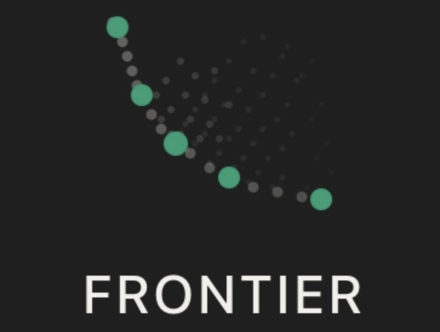
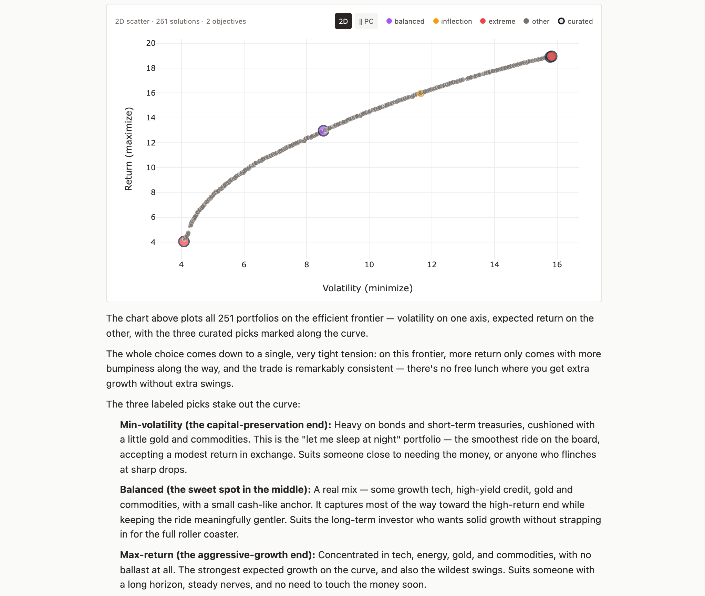
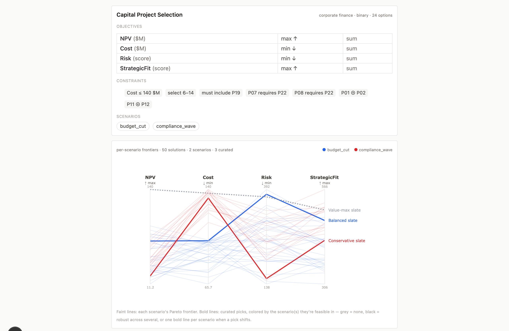
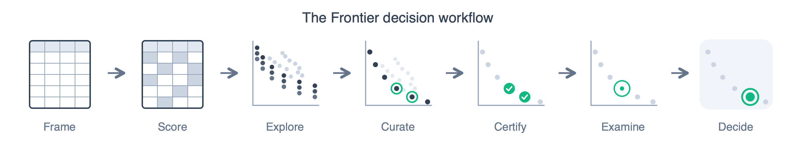
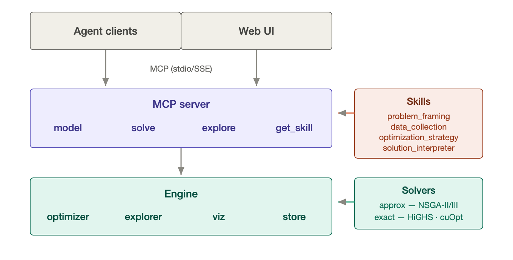

<p align="center">
  
</p>

<p align="center">
  Multi-objective decision optimization toolkit. Use in any MCP client or via the integrated web UI.
</p>

## Summary

Frontier helps you make hard decisions that have many options and conflicting goals: which projects to fund, how to split a budget, who to source from. You describe the decision to an AI agent in plain language; it models the problem, optimizes it, and walks you through the **full set of optimal tradeoffs** rather than one black-box answer. You make the final call.

Under the hood it maps the **Pareto frontier** (every option where you can't improve one goal without sacrificing another) with evolutionary search plus optional exact solvers, all exposed as MCP tools. Every number it reports is computed, not guessed, so the decision stays explainable and auditable, and the engine never overrides the two calls that are yours: how to frame the problem and which tradeoff to pick.

**Try it:** the [hosted demo](https://frontier-ui.onrender.com/) (ask @cafzal for access), or [set up your own](#setup) in any MCP client.

## Examples

[Worked examples](examples/) you can load and adapt: each ships a paste-ready prompt that reproduces the result. Two shown:

<table>
<tr>
<td width="50%" valign="top">
<br/>
<sub>Investment portfolio: risk / return / yield frontier with a plain-language tradeoff read</sub>
</td>
<td width="50%" valign="top">
<br/>
<sub>Capital project selection: 120 projects, exact-certified, with per-scenario frontiers</sub>
</td>
</tr>
</table>

## Purpose

Spreadsheets hit a complexity wall once options and constraints in a decision multiply. Generative AI models reason about tradeoffs but can't *solve* them: they can't reliably enumerate a huge option space, enforce hard constraints, and produce the frontier. Frontier fills the gap: the LLM translates and narrates, an optimizer does the math, and you get the tradeoffs instead of a guess.

**When it fits:** any decision that picks a subset from many options or splits an allocation across them, under conflicting objectives and hard constraints, with data to score the options. Pairwise interactions make it genuinely nonlinear.

**What it adds beyond an LLM alone:**
- **Full tradeoff frontier**: every Pareto-optimal option, not one recommendation or a weighted ranking.
- **Optional exact audit**: certify the finalists against an exact solver (HiGHS on CPU, cuOpt on GPU) on supported shapes; it catches dominated points the heuristic showed as efficient.
- **Hard constraints, enforced**: eight types: cardinality, force include, force exclude, objective bounds, exclusion pairs, dependencies, group limits, and allocation caps.
- **Grounded & reproducible**: every number traces to computed data, and the same inputs + seed reproduce the exact frontier.
- **Scenarios & risk**: independent frontiers per scenario, plus CVaR / worst-case / expected / minimax-regret per objective.
- **Knowledge discovery**: mine the frontier for selection rates, design principles, and strategy families (`explore composition`).
- **Persistent state**: problems persist across sessions (on a deployment with durable storage — the default Render blueprint is ephemeral); curated picks track survival across re-runs.

## Workflow

<p align="center"></p>

Drive Frontier by interacting with an AI agent, in a coding-agent MCP client or the hosted web chat, in plain language. The agent translates your decision into Frontier's model, runs the solver, and reads the results back. A typical sequence (you describe what you want; the agent picks the tools):

1. **Frame it.** Name the objectives (what to maximize or minimize), the options to choose among, and any hard constraints, plus scenarios if the future is uncertain. *e.g. "We're choosing a CRM for a 10-person startup: maximize features and support, minimize cost; budget under $50k/yr; pick one."*
2. **Score the options.** Hand over the numbers, or let the agent estimate and flag what's shaky. *e.g. "Score these five CRMs on cost and support from their pricing pages."*
3. **Solve.** The agent validates the setup, then runs the optimizer for the Pareto frontier, optionally once per scenario. *e.g. "Solve it."*
4. **Explore the tradeoffs.** Frontier shape, the extremes, the balanced/knee, the marginal cost of pushing an objective, robustness across scenarios. *e.g. "Show the tradeoffs and recommend a balanced pick."*
5. **Certify and examine.** Before committing, audit the frontier against an exact solver where the shape supports it (`explore certify` sharpens the risk corner and flags any dominated points), then read the solver-exact sensitivity (`explore sensitivity` for where-to-invest shadow prices and near-miss reduced costs). *e.g. "Certify the finalists and show me what's binding."*
6. **Iterate.** Tighten a constraint, add a scenario, re-solve, and compare against the previous run. *e.g. "Cap cost at $40k and re-run: what dropped off the frontier?"*
7. **Decide.** Curate the finalists and commit to the pick that fits your tradeoffs: the engine lays out the options and leaves the final call to you. *e.g. "Curate the balanced plan as 'Lean choice' and commit."*

### Saving & loading

Every problem is auto-persisted in the engine's store (`data/`, keyed by id) – session state you don't manage. Separately, `model save` writes a **named, portable copy** in the [examples](examples/) format, to reload or share by name:

- **`model save problem_id=… save_as="<name>"`**: save to your gitignored `saved/` library (override with `FRONTIER_SAVED_DIR`), bundling the solved frontier when present.
- **`model load source="<name>"`**: rebuild a problem, resolving `saved/` first, then bundled `examples/`; omit `source` to list available names.

## Architecture

<p align="center"></p>

Frontier is a Python MCP server (FastMCP) wrapping pymoo's NSGA-II/III evolutionary solvers, with two first-class exact-solver backends (HiGHS on CPU, cuOpt on GPU) the agent can elect per run as an audit layer over the heuristic frontier. State persists per-problem as JSON; the optimizer produces a Pareto frontier with quality indicators, scenario-aware results, and shadow-price rates per binding constraint. Domain expertise lives in skill markdown files that the server auto-injects at workflow transitions.

For full schemas, action parameters, data model, persistence layout, and the skill auto-injection mechanism, see [`architecture.md`](architecture.md). For skill, prompt, and MCP design principles, see [`best-practices.md`](best-practices.md).

### Tools

Four MCP tools – full action lists and parameters in [`architecture.md`](architecture.md):

- **`model`**: define and edit the problem (objectives, options, scores, 8 constraint types, interaction matrices, scenarios): `create` / `update` / `get`, plus `save` / `load` for named problems.
- **`solve`**: validate and optimize (NSGA-II/III, fast/thorough, seeded): `run`, `run_scenarios`, and `status` to poll background runs; opt-in `solver="highs"|"cuopt"` exact backends on supported shapes.
- **`explore`**: navigate results: `tradeoffs`, `certify` (audit the exact overlay), `sensitivity` (solver-exact shadow prices + near-misses), `composition` (mine selection rates, principles, strategy families), plus `compare` / `solutions` / `scenario_results` / `curate`.
- **`get_skill`**: fetch the workflow guidance below.

### Skills

Markdown guides the server auto-injects at workflow transitions (also fetchable via `get_skill`) – domain judgment, not tool docs:

- **`problem_framing`**: objectives vs constraints, approach + aggregation, scenario definition.
- **`data_collection`**: score elicitation without anchoring bias, quality signals.
- **`optimization_strategy`**: iteration, constraint strategy, infeasibility, re-run judgment.
- **`solution_interpreter`**: presenting tradeoffs without a "best", eliciting preferences, curation.

## Setup

Two ways to use Frontier:

- **Web UI**: a browser chat shell over the engine, with interactive charts and curation. Try the hosted app at **[frontier-ui.onrender.com](https://frontier-ui.onrender.com/)** (password-gated – ask @cafzal for access), or run/deploy your own (requires an API key; see [`ui/`](ui/) and [Deploy your own](#deploy-your-own))
- **MCP client**: connect any MCP-compatible client (Claude Code, Claude Desktop, claude.ai, Cursor, Codex). The hosted beta engine (`https://frontier-592q.onrender.com/sse`) is gated by a token – ask @cafzal for `FRONTIER_TOKEN`; or [self-host](#self-host) your own (ungated by default).

The MCP-client snippets below assume the hosted engine.

### Claude Code (terminal)

```bash
claude mcp add frontier --transport sse \
  --url https://frontier-592q.onrender.com/sse \
  --header "Authorization: Bearer $FRONTIER_TOKEN"
```

### Claude Desktop

Add to `~/Library/Application Support/Claude/claude_desktop_config.json`:

```json
{
  "mcpServers": {
    "frontier": {
      "transport": "sse",
      "url": "https://frontier-592q.onrender.com/sse",
      "headers": { "Authorization": "Bearer YOUR_FRONTIER_TOKEN" }
    }
  }
}
```

### claude.ai (MCP integrations)

Add Frontier as a remote MCP server in claude.ai settings using the SSE URL `https://frontier-592q.onrender.com/sse`, with an `Authorization: Bearer <FRONTIER_TOKEN>` header.

### Self-host

Run your own instance instead of using the hosted one. Requires Python 3.11+.

```bash
git clone https://github.com/cafzal/frontier.git
cd frontier
pip install -e .

# stdio transport (for Claude Desktop / coding agents on the same machine)
python -m mcp_server.server

# SSE transport (for remote MCP clients)
MCP_TRANSPORT=sse python -m mcp_server.server

# Gate a public instance with a shared bearer token – clients must then send
# `Authorization: Bearer <token>`. Leave unset for an open local instance.
FRONTIER_MCP_TOKEN=your-secret MCP_TRANSPORT=sse python -m mcp_server.server
```

Point your MCP client at the local server – for SSE that's `http://localhost:8000/sse`. The optional web UI lives in [`ui/`](ui/) – see its [README](ui/README.md).

**Exact solvers (optional).** Install `highspy` (CPU; `pip install highspy`) or cuOpt (NVIDIA GPU) to unlock `solver="highs"|"cuopt"` (no GPU at hand? [examples/cuopt_colab.ipynb](examples/cuopt_colab.ipynb) is a ready Colab template for the cuOpt arc): exact certification (`explore certify`) and solver-exact sensitivity (`explore sensitivity`) on supported shapes. How it works (the shared scalarization engine, the certify invariant, which shapes carry duals) is in [`architecture.md`](architecture.md#solver-backends-pluggable).

### Deploy your own

Both pieces are plain web services – host them anywhere (Render, Fly, Railway, a VPS, Docker):

- **Engine** (Python) – `pip install ".[sse]"` (add `,highs` for the CPU exact backend), then `MCP_TRANSPORT=sse python -m mcp_server.server`. Set `MCP_HOST=0.0.0.0` and `FRONTIER_MCP_TOKEN`; the host supplies `$PORT`. Must be publicly reachable – Anthropic's MCP connector calls it. (A routable bind without `FRONTIER_MCP_TOKEN` refuses to start, rather than serve an open engine.)
- **Web UI** (Node, in `ui/`) – `npm install && npm run build`, then `npm start`. Set `FRONTIER_MCP_URL` (the engine's `/sse`), `FRONTIER_MCP_TOKEN`, `ANTHROPIC_API_KEY`, `AGENT_BACKEND=messages-api`, and `UI_ACCESS_PASSWORD` (a production build refuses to serve until this is set). Long-session context management and prompt caching are env-tunable (`AGENT_CONTEXT_WINDOW`, `AGENT_CONTEXT_MANAGEMENT`, `AGENT_PROMPT_CACHE`, and related); [`architecture.md`](architecture.md#5-web-ui--hosting) documents the knobs and defaults.

`FRONTIER_MCP_TOKEN` must match on both – that's what authenticates the UI to the engine.

**Render (one-click example):** [`render.yaml`](render.yaml) provisions both as a blueprint.

## Background

Optional background – the thinking behind Frontier and how it's evolved:

- [Building an AI-Powered Decision Tool Prototype: A Product Manager's Journey](https://camafzal.substack.com/p/building-an-ai-powered-decision-tool) – May 2025
- [Lowering the Barriers to Decision Optimization with AI](https://camafzal.substack.com/p/lowering-the-barriers-to-decision) – Sep 2025
- [Making optimization accessible: AI as the translation layer](https://camafzal.substack.com/p/making-optimization-accessible-ai) – Jan 2026
- [Agents have a convergent reasoning gap](https://camafzal.substack.com/p/agents-have-a-convergent-reasoning) – Apr 2026

## Contributing

Contributions welcome – start with the developer docs:

- [`architecture.md`](architecture.md) – system architecture & data flow
- [`best-practices.md`](best-practices.md) – skill & prompt design guidelines

## Acknowledgements

Frontier builds on excellent open-source optimization work, with thanks to:

- **[pymoo](https://github.com/anyoptimization/pymoo)** (Apache-2.0) – the NSGA-II / NSGA-III evolutionary solvers at Frontier's core. Blank, J. & Deb, K. (2020). *pymoo: Multi-Objective Optimization in Python.* IEEE Access, 8, 89497–89509. The underlying algorithms are Deb et al., NSGA-II (2002) and Deb & Jain, NSGA-III (2014).
- **[HiGHS](https://github.com/ERGO-Code/HiGHS)** (MIT) – CPU exact-solver backend (`solver="highs"`). Huangfu, Q. & Hall, J.A.J. (2018). *Parallelizing the dual revised simplex method.* Mathematical Programming Computation, 10(1), 119–142.
- **[NVIDIA cuOpt](https://github.com/NVIDIA/cuopt)** (Apache-2.0) – GPU exact-solver backend (`solver="cuopt"`).

## License

Apache License 2.0 – see [LICENSE](LICENSE) and [NOTICE](NOTICE).
