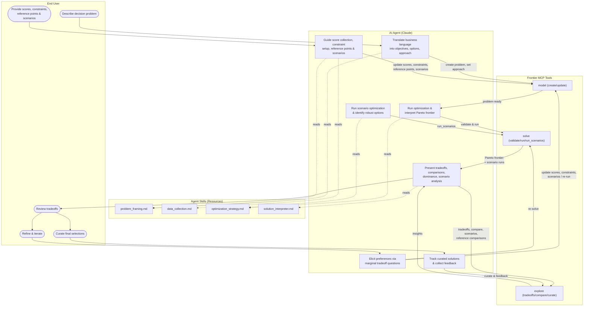
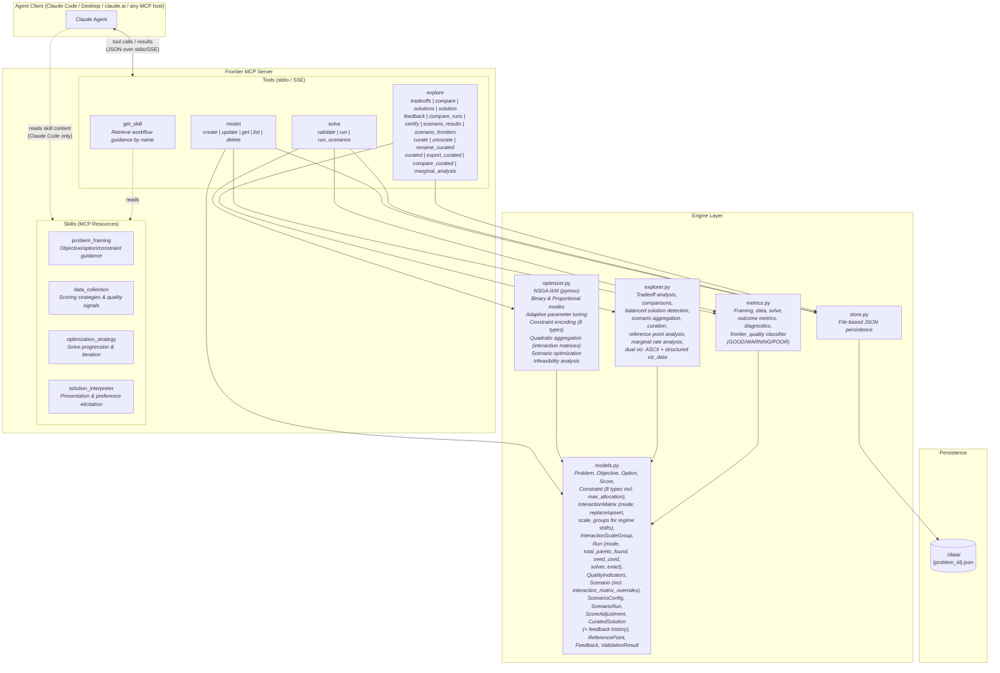
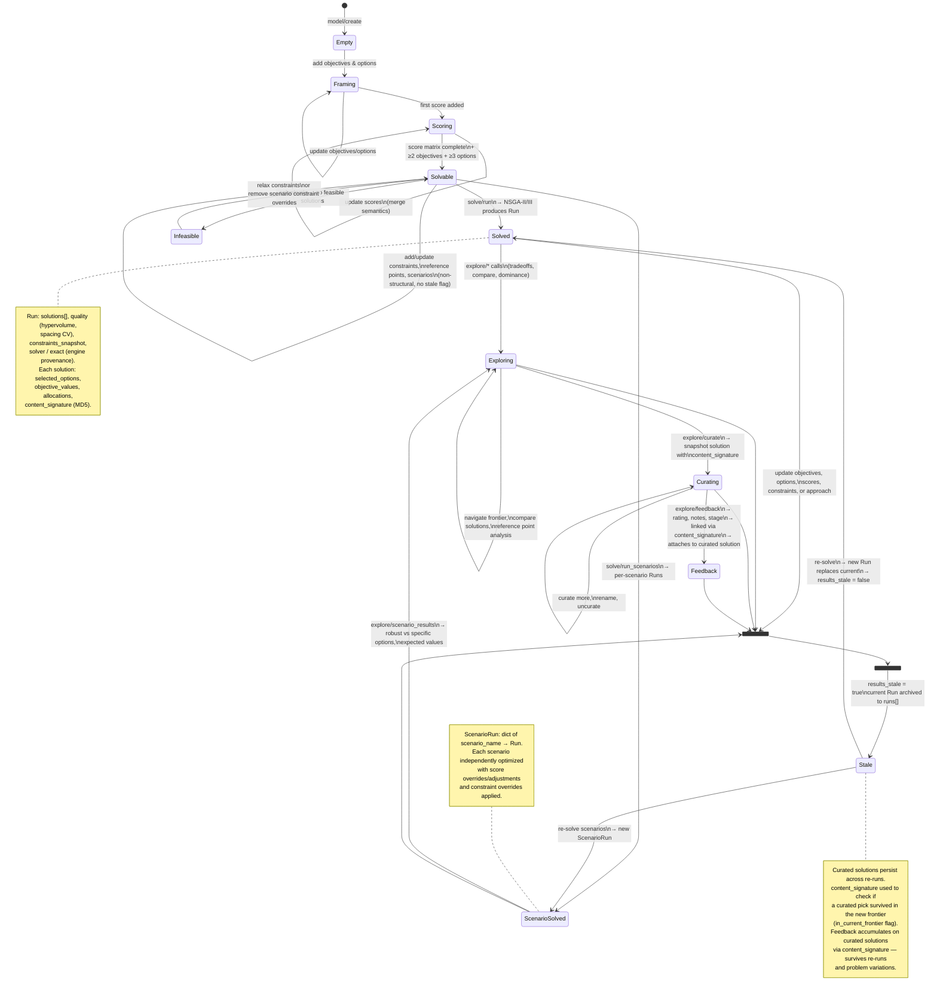
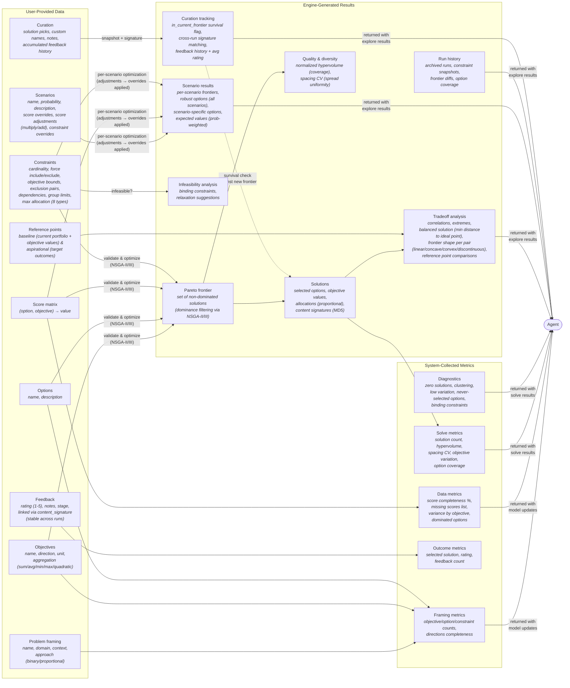

# Frontier — Architecture Reference

**Related docs:** [`best-practices.md`](best-practices.md) — skill, prompt & MCP design guidelines | [`README.md`](README.md) — user setup and usage guide

## Design Principle: Deterministic Guardrails + Human Judgment

Frontier's architecture separates what must be **deterministic** from what requires **human judgment** — the split that makes its optimization explainable and governable. Every component below sits on one side of this line.

- **Deterministic guardrails (engine layer).** Computed from problem state, not model output, so the same inputs always yield the same result. Hard-constraint enforcement during search (`optimizer.py`, 8 constraint types — never violated); Pareto dominance filtering (NSGA-II/III); seeded reproducibility (`seed` / `seed_used` — same inputs + seed reproduce the exact frontier, in- and cross-process; `optimizer._seeded_rng_fallback` makes pymoo's otherwise-unseeded survival/selection RNG deterministic); pre-solve constraint-conflict validation (`optimizer._check_constraint_conflicts`); infeasibility analysis with relaxation suggestions; and frontier quality gates (`metrics.frontier_quality` → GOOD/WARNING/POOR). `metrics.py` states the contract directly: "deterministic signals from problem state … not LLM-generated."
- **Human judgment (agent + skills layer).** The skills steer the two calls that stay with the human — *framing* (objectives vs. hard constraints) and *selection* (which non-dominated solution to commit to). `solution_interpreter` enforces "never say best" and **traceable claims**: every quantitative statement must trace to returned data (a score, an objective value, a shadow price, a dominance relation), so a stakeholder can audit the reasoning line by line. Curation is the human's act of choosing; the engine records it but never makes it.

**Tighter optimality is an optional tier of the same determinism.** The default NSGA path is deterministic and reproducible but *heuristic* — it approximates the frontier. On supported problem shapes the agent can elect an exact-solver backend ([§ Solver Backends](#solver-backends-pluggable)) that makes each frontier point *optimal to a 0.1% gap* (a certified zero gap with `exact=true`) rather than approximate — a stronger form of the engine-side guarantee. Choosing *when* to pay for that **exact pass** is itself the human/skill judgment (the `optimization_strategy` skill guides it); the exact run, once elected, is deterministic. So exact solvers don't add a third layer — they deepen the deterministic guardrail and hand the agent one more judgment call.

The layers in §2 realize this split: the **Engine Layer** is the deterministic core, the **Skills** are the judgment scaffold, and the **MCP Tools** are the interface between them. Read the rest of this document through that lens.

## Tools & Skills Reference

### MCP Tools

Frontier exposes 4 tools — 3 domain tools with multiple actions, plus a skill delivery tool:

| Tool | Action | Purpose |
|------|--------|---------|
| **model** | `create` | Start a new optimization problem (name, domain, context, approach) |
| | `update` | Add/modify objectives (2–7), options, scores, constraints, reference points, scenarios. Merge semantics for scores; full replacement for everything else. Marks results stale on structural changes. |
| | `get` | Return problem state. Optional `section` param for targeted slices: summary, objectives, options, scores, constraints, matrices, scenarios, run, runs, exact_run, curated, references. Without section: full dump. |
| | `list` | List all problems with metadata snapshots |
| | `delete` | Remove a problem and its data file |
| | `save` | Save a problem to the user's library (`saved/<name>/`) in the portable examples format. Params: `problem_id`, `save_as` (name; defaults to a slug of the problem name). Always includes `solutions.json` when the problem has a run. |
| | `load` | Load a problem by name in the portable format, resolving `saved/` first then bundled `examples/` (a save shadows a like-named example). Mints a fresh `problem_id`, registers it in the store, restores scenarios + prior results. Omit `source` to list available names. |
| **solve** | `validate` | Pre-flight check: ≥2 objectives, ≥3 options, complete score matrix, feasible constraints. Also returns a `solvers` block — which engines are `available` in this environment and whether the optional exact backends `exact_fits_shape` for this problem — so the agent can make an informed `solver` choice. |
| | `run` | Validate then optimize. Returns compact result — `objective_ranges`, `preview` (per-objective extremes + balanced solution by id/objective_values only), `quality`, `seed_used`, `total_pareto_found` (pre-pruning count), `frontier_complete` (bool — true when returned set is the full Pareto frontier, false when pruning truncated it), `frontier_quality` (status GOOD/WARNING/POOR with progressive gates and issues), `metrics`, `full_result_path` (disk path to complete JSON with all solutions — preferred for bulk export or artifact assembly), and `next_steps` pointer. Full solution detail also retrievable via `explore solutions` / `explore solution <id>`. Optional `mode`: "fast" (default, quick iterations) or "thorough" (final convergence). Optional `max_solutions` caps Pareto set size (default 100). Optional `seed` (int) for reproducibility (same inputs + seed → same frontier; echoed as `seed_used`); omitted = fresh random seed drawn and echoed. Auto-selects NSGA-II (2-3 obj) or NSGA-III (4+ obj). Parameters adapt to solution space size and objective count. Optional `solver` selects the engine — default NSGA (evolutionary, any shape) or an opt-in exact backend `"highs"`/`"cuopt"` (each frontier point optimal to a 0.1% gap on supported shapes, zero-gap with `exact`; see *Solver Backends*); the engine that ran is echoed as `solver_used`. Optional `exact` (bool) certifies each **MILP** inner solve to a zero gap (no-op on the always-exact QP and on the default NSGA path). A requested exact solver that is uninstalled or ill-fitting returns a clear error rather than silently falling back. **Long runs execute in the background** (see *Long-running solves*): the response is either the compact frontier result (fast solves, unchanged) or a `{status:"running", job_id}` handle to poll via `solve status`. Optional `time_limit` (s) caps wall-clock — the run stops at its budget or the cap, whichever first, returning a best-so-far frontier flagged `time_limited` (echoed on the result). Optional `wait_seconds` tunes the inline wait before a handle is returned (0 = return a handle immediately). |
| | `run_scenarios` | Independently optimize each scenario with score overrides/adjustments. Accepts optional `mode`, `max_solutions`, and `seed` (per-scenario seeds are deterministically derived from the parent so each scenario reproduces while starting from a distinct initialization), plus `time_limit` / `wait_seconds`. Also background-dispatched, same as `run`. |
| | `status` | Poll a background solve by `job_id` (from a `run`/`run_scenarios` that returned `status="running"`). Returns `status="running"` (with `elapsed_s` + a `label`) until the solve finishes, then the full solve result (with the `solution_interpreter` skill, injected once per problem at delivery). A `status="stale"` result means the problem's solve-inputs were edited mid-solve — nothing was overwritten; re-run. |
| **explore** | `tradeoffs` | Frontier overview: total solution count, objective ranges, correlations + normalized MI per pair (MI computed when n≥15), extremes, balanced solution (ideal-point closest), inflection-point candidates (diminishing-returns boundaries), frontier shape classification per conflicting pair (linear / concave / convex / discontinuous, with confidence), binding_analysis (shadow-price rates per binding constraint — how much each objective shifts per unit of slack relaxation, derived from frontier; objective_bound / cardinality / group_limit), objective_redundancy (classification per pair using Pearson + MI, flags Pearson/MI disagreement = non-linear dependence), vs references. Optional `scenario` param targets a specific scenario's frontier; optional `source="exact"` retargets analysis at the `exact_run` overlay instead of the default NSGA `run` (threaded through compare / solutions / solution / curate / marginal_analysis too). Every analytics result (tradeoffs / compare / solutions / solution / marginal_analysis) echoes `frontier_source` (`{run_id, solver, kind: heuristic\|exact}`) so a dropped or omitted `source` can't pass a heuristic frontier off as exact; a heuristic frontier served while an exact overlay exists also flags `exact_overlay_available`. |
| | `sensitivity` | Solver-exact duals from an exact continuous (QP) run: `where_to_invest` (constraint shadow prices, ranked — marginal objective change per unit relaxed) + `near_misses` (unheld options by reduced cost, closest first) + `capped_options` + `frontier_shadow_price_trend`, anchored on a reference solution (default balanced; `solution_id` overrides). The *exact* counterpart to `binding_analysis`; falls back to the frontier-inferred binding analysis on heuristic/MILP runs. Tagged `source=solver_exact｜frontier_inferred`; continuous/QP only (integer/MILP solutions have no exact duals). |
| | `compare` | Side-by-side comparison of 2+ solutions (shared/differentiating options, tradeoff summary). Optional `scenario` param. |
| | `solutions` | Pareto frontier listing. Default: compact (solution_id + objective_values + content_signature). Pass `detail=true` for full dump including selected_options and allocations. Optional `scenario` param. |
| | `solution` | Single solution detail with reference point analysis. Optional `scenario` param. |
| | `feedback` | Record user feedback: solution_id or content_signature, rating (1-5), notes, stage. Links to content_signature (stable across runs) and attaches to matching curated solution. |
| | `compare_runs` | Diff run history: criteria changes, frontier diffs, option coverage |
| | `certify` | Audit the exploratory NSGA frontier against the exact overlay. **No params**: audits the current `run` against the `exact_run` overlay (solve, then solve with an exact solver, then certify). Optional `run_ids` = exactly two (one NSGA + one exact, order-free — exact auto-detected by its solver) override with explicit historical runs. Returns a solver-agnostic certificate: `dominance_audit` (which NSGA points an exact solve dominates + fraction), `coverage` (hypervolume the overlay reclaims over NSGA — `reclaimed_fraction`), `invariant` (NSGA never dominates an exact point), `corner_sharpening` per objective (exact vs NSGA best, status sharpened/matched/under-sampled, is_risk_corner), `headline_corner`, and a `recommendation`. See *Solver Backends*. |
| | `scenario_results` | Per-scenario analysis with frequency-weighted option importance. Returns option_robustness sorted by importance (avg_frequency x avg_weight) with tiers: core (>50% in all scenarios), common (>25%), marginal (<25%). Also: scenario-specific options, expected values (ideal-point, probability-weighted), scenario_risk per objective (expected / worst_case / best_case / cvar_<alpha>%). Optional `cvar_alpha` (float in (0,1), default 0.2) sets the CVaR tail fraction. |
| | `scenario_frontiers` | Per-scenario Pareto frontiers overlaid for visualization. `viz_data` colors each scenario's frontier for the web UI's parallel-coordinates overlay and emphasizes curated picks (bold, colored by the scenarios they're feasible in); ASCII surfaces a per-scenario objective-range table. Shows how the achievable tradeoffs shift across futures. |
| | `curate` | Add a solution to the curated set with custom name and notes. Optional `scenario` param for curating from scenario frontiers. |
| | `uncurate` | Remove a solution from the curated set by content signature |
| | `rename_curated` | Update a curated solution's custom name |
| | `curated` | List all curated solutions with `in_current_frontier` survival flag |
| | `export_curated` | Export the curated set as a formatted handoff artifact: markdown table (default) or CSV (`format="csv"`). Columns: name, content_signature, objective values, selected_options. Invalid format errors cleanly. |
| | `compare_curated` | Compare curated solutions side-by-side by content signature. Default: compact (shared/differentiating options + objective values). Pass `detail=true` for full selected_options and allocations per solution. |
| | `marginal_analysis` | Marginal rate analysis: cost-per-unit between adjacent solutions, inflection point detection (where marginal cost jumps sharply). Default summary; `detail=true` for per-pair breakdown. Optional `scenario` param. |
| **get_skill** | *(single action)* | Retrieve workflow guidance by name. Returns full skill markdown. Works with all MCP clients (unlike resources, which require client-side resource support). Available skills: `problem_framing`, `data_collection`, `optimization_strategy`, `solution_interpreter`. |

**Rendering surfaces.** `explore` actions (and `model get` summary) emit both an ASCII `visualization` for chat / coding-agent clients and a structured `viz_data` payload for chart-rendering surfaces. The web UI renders `viz_data` via Plotly: frontier solutions adapt to dimensionality (2 obj → 2D scatter, 3 → 3D scatter, ≥4 → parallel coordinates, with a scatter⇄PC toggle), scenarios overlay as colored parallel coordinates with curated picks emphasized, and the formulation renders as a typed card. Clicking a point (or brushing parallel coordinates) curates it through the agent.

### MCP Skills (Resources + Tool)

Skills are available two ways for maximum client compatibility:
1. **`get_skill` tool** (universal) — works with any MCP client. Call `get_skill('problem_framing')` etc.
2. **MCP resources** (backward compat) — `frontier://skills/*` URIs, for clients that support resource reads.

Skills provide domain guidance the agent consults at each workflow stage:

| Skill | Purpose |
|-------|---------|
| **problem_framing** | Translate decision language into objectives/options/constraints. Covers objective vs constraint classification (principle-based, not keyword matching), hidden objective detection, approach selection (binary vs proportional — "does quantity matter?"), aggregation modes (canonical definition — sum/avg/min/max/quadratic), interaction matrices for quadratic aggregation, reference points, scenario definition, question anchors for guiding problem exploration. Cross-referenced by other skills. |
| **data_collection** | Guide score elicitation. Covers data readiness levels, anchoring techniques, batch efficiency, source evaluation, conflict resolution, score quality signals (variance, scale mismatch), aggregation implications on scoring (cross-references problem_framing), completeness drive. |
| **optimization_strategy** | Drive solve progression. Covers iteration expectations, validate→run→examine flow, constraint strategy (cross-references problem_framing for types), infeasibility response, binding constraint detection, curated solution survival tracking, run comparison, scenario interpretation, stale results and re-run judgment. |
| **solution_interpreter** | Present results without bias. Core Judgment (always apply): "never say best", five explanation dimensions, presentation order (Extremes → Balanced → Inflection → Risk → Preference), tradeoff framing, objective ranking elicitation, dominance explanation, question anchor (connect results back to user's original decision question). Presentation Refinements (situational): visualization, run diffs, reference point narration, scenario presentation, diagnostics, preference learning, curation guidance. Reference: `references/explore-diagnostics.md` for detailed field schemas of tradeoff and scenario result blocks. |

---

## 1. User Workflow

How an end-user interacts with the AI agent, which drives Frontier on their behalf.

## 2. System Architecture

MCP tools, skills, engine internals, and how they connect to the agent client.

### Problem Persistence: Live Store vs Portable Bundles

A problem persists two ways: the **live store** (`store.py` → `data/{problem_id}.json`) holds the full canonical `Problem` keyed by UUID (session state — a stateful deployment just mounts a disk here); writes go through an **atomic** `save` (temp file + `os.replace`), so a concurrent reader never sees a half-written file and a background solve worker can persist without tearing a foreground edit (see *Long-running Solves*). **Portable bundles** (`problem_io.py`, the `model save` / `load` format the [`examples/`](examples/) use) split it across `problem.json` (definition), `scores.json` (data), and `solutions.json` (results, written when solved). `save` writes to a gitignored `saved/` library; `load` resolves a name against `saved/` then `examples/`, minting a fresh `problem_id`. `problem_io` is also where the examples' top-level `scenarios` list is bridged to `scenario_config` (`enabled=True`) — a naive `Problem(**problem_json)` would drop scenarios, since the field is `scenario_config` and pydantic ignores unknown keys.

### Solver Backends (Pluggable)

The default solve path is pymoo's NSGA-II/III for all problem shapes. Two **opt-in exact-solver backends** sit alongside it as an **optional audit / certification layer** over that heuristic exploration, gated so the default path never imports either (each imports its solver lazily, so the modules load whether or not that solver is present). Both share **one NSGA-scalarization engine** ([`solvers/_scalarization.py`](solvers/_scalarization.py)): NSGA-II evolves epsilon-constraint scalarization targets — and, under a cardinality/group cap, an asset-selection priority vector — while an injected **inner solver** solves each scalarized single-objective problem to optimality, and the Pareto frontier is assembled from those exact inner optima. NSGA explores the scalarization space; the inner solver makes each evaluated point optimal to a 0.1% gap instead of heuristic. The two backends differ **only** in that injected inner solve, and both return the engine's exact `Run` / `Solution` shape — so explorer, metrics, and store need zero changes. Additive, gated, reversible. In OR terms this is the *sequential-collaborative* matheuristic pattern — the heuristic explores, the exact solver certifies — reusing the same optimality-gap-against-a-bound a MILP solver already reports for its own incumbent, here applied across a Pareto front rather than a single objective.

**The exact run is an auditor, not a replacement.** Because each inner solve is optimal for its scalarization, overlaying exact points on the heuristic frontier can only **confirm or improve** it, never worsen it — the invariant *NSGA never dominates an exact point* (strict for the MILP, which is integer by construction; for the QP, rare violations can only come from integer-rounding the continuous optimum to whole-percent allocations, and are reported as such, not as a heuristic win). In practice exact does three things: it **sharpens the convex risk/variance corner** — the flat convex bowl where heuristics wobble and a QP is exact, i.e. the minimum-risk portfolio a risk-averse decider hinges on (min-volatility, most-diversified sourcing, firmest grid); it **audits heuristic slack** by flagging NSGA points shown as efficient that an exact solve dominates; and on a binary MILP it returns the **optimal subset** for its targets (to a 0.1% gap, certified zero-gap with `exact=true`). Where exact instead looks "short" of NSGA at a linear extreme, that's the EA's epsilon-target sampling budget — a denser sweep or targeted solve closes it — not a capability limit.

**Agent-selectable per run (provable optionality).** Solver choice is a **per-run decision made by the agent** — there is one selection mechanism, the `solver` argument, no deployment-wide env toggle. Solver choice is problem-shape- and workflow-phase-dependent (explore with the EA, certify a finalized pick with an exact solver), so a global default would fight that flow rather than help it. `solve(solver="highs"|"cuopt", exact=…)` threads through `optimizer.optimize(..., solver=…)`; omitted (or `"nsga"`) runs the default evolutionary search. [`solvers/__init__.py`](solvers/__init__.py) owns the two pure checks both the tool and `optimize()` consult — `available_solvers()` (probes importability with `importlib.util.find_spec`, so it answers without importing the solver) and `exact_solver_fits(problem)` (the shared shape gate, one scope for both backends: **binary selection** with every objective `sum`-aggregated — the MILP is linear in the 0/1 vars, so `avg` (fractional over a variable-size pick), `min`/`max`, and `quadratic` (nonlinear) are each declined *with a redefine hint* rather than silently optimized as a sum; or **proportional mean-variance** — a **minimize**-direction `quadratic` *risk* objective backed by an interaction matrix alongside `sum`/`avg` linear objectives, with `min`/`max` (nonlinear) and a *maximize* quadratic (non-convex) declined). The `solve` tool guards on both before running and returns an actionable error if the requested solver is uninstalled or ill-fitting — it never silently degrades to NSGA, so a result that claims optimality always ran an exact engine. Every run records `Run.solver` / `Run.exact` and echoes `solver_used` in the response, keeping the frontier traceable to the engine that produced it (the same "traceable claims" contract the skills enforce). The `optimization_strategy` skill's *Exact Solvers* section carries the agent-facing workflow guidance: when to upgrade from EA exploration to an exact-audited frontier, and how to narrate it without over-claiming.

The two backends are **first-class and co-equal** — the same auditor engine over two inner solves, one GPU and one CPU; pick by the hardware on hand, not by tier.

- **NVIDIA cuOpt** (`solvers/cuopt_backend.py`, `solver="cuopt"`) — the **GPU exact backend**: a convex min-variance **QP** for proportional mean-variance portfolios and a 0/1 **MILP** for binary selection. The QP has two equivalent builds — the term-by-term high-level `Problem` API (`_solve_qp_cuopt`, GPU-verified) and a scalable matrix `data_model` / CSR build (`_solve_qp_cuopt_matrix`) that drops the O(n²) Python-expression construction for a dense covariance to one vectorised conversion; both pack the same covariance, so they return the same optimum (the `_USE_MATRIX_QP` flag selects, default off pending GPU confirmation). Needs `cuopt-cu12` + a GPU, so it runs in Colab. cuOpt MILP solves run in **deterministic mode** (`CUOPT_MIP_DETERMINISM_MODE`) — the mode Frontier's seeded-reproducibility contract needs (cuOpt's default *opportunistic* mode can return a different optimum run-to-run), which as a side effect takes the *sequential* LP root relaxation: the epsilon sweep proposes infeasible corners the engine expects (scored dominated), and cuOpt's *concurrent* root solve aborts the process (`std::terminate`, an uncatchable kernel crash) on an infeasible relaxation, whereas the sequential path returns `Infeasible` as a clean `ok=False` like HiGHS — a configuration fix, not a workaround.
- **HiGHS** (`solvers/highs_backend.py`, `solver="highs"`) — the **CPU exact backend**: the same engine with HiGHS inner solves. Exact **MILP** for binary selection with additive (`sum`) objectives (every Frontier combinatorial constraint — cardinality, force in/out, dependency, exclusion, group limit, objective bound — is linear-integer, handled exactly; the [`capital_project_selection_120`](examples/capital_project_selection_120) showcase) and convex **QP** for mean-variance portfolios (linear `sum`/`avg` objectives plus the quadratic risk term). HiGHS can't solve MIQP, but never has to: under a cardinality/group cap the EA picks *which* assets are eligible and HiGHS solves the continuous QP on that support exactly. The solver is a plain `pip install highspy` (CPU, cross-platform, no special index, no GPU), so the exact path — and the shared NSGA engine with it — runs and is tested on the same machine as the engine ([`tests/test_highs_backend.py`](tests/test_highs_backend.py)).

Both backends accept `optimize(..., exact=True)` to certify each MILP inner solve (zero gap) instead of the default speed-oriented bounded solve. The independent scalarizations can also run concurrently through a thread pool (`_parallel_solve`, solver-agnostic — cuOpt releases the GIL during its GPU solve, HiGHS during its CPU solve), the DIY `concurrent.futures` pattern that cuOpt's deprecated `BatchSolve` now points to. The matrix QP build and parallel solve are exercised, measured, and compared against HiGHS in the [`exact_solver_comparison`](examples/exact_solver_comparison) showcase (dense-QP-at-scale and parallel-throughput panels); the CPU-checkable parts are covered by [`tests/test_cuopt_matrix.py`](tests/test_cuopt_matrix.py).

**Certifying a heuristic frontier against exact.** `engine.explorer.certify_against_exact(problem, nsga_run, exact_run) -> dict` ([`engine/explorer.py`](engine/explorer.py)) makes the auditor framing a concrete, returnable artifact: it overlays an exact run on an NSGA run of the same problem and returns a certificate with four parts — a **`dominance_audit`** (`nsga_dominated_by_exact`, `nsga_dominated_fraction`, `examples` — the heuristic slack exact catches), a **`coverage`** block (`reclaimed_fraction` / `exact_reclaims` — the hypervolume the overlay reclaims over NSGA alone, the magnitude behind the dominance count, normalized against a shared reference so it is fair to both fronts and grows with problem size), the **`invariant`** (`holds`, `exact_dominated_by_nsga`, `note` — confirming NSGA never dominates an exact point, with the QP integer-rounding caveat surfaced in the note rather than asserted away), and **`corner_sharpening`** per objective (`nsga_best`, `exact_best`, `improvement`, `status` ∈ `sharpened` | `matched` | `under-sampled`, `is_risk_corner`), plus a `headline_corner` and a plain-language `recommendation`. The certificate is scoped to *per-scalarization optimality + dominance + coverage* — deliberately **not** a proof that the whole frontier is optimal (no single optimum exists for a true multi-objective problem); the invariant is a soundness check on the overlay, not an independent quality score. It is surfaced as the MCP **`explore certify`** action. An exact solve is stored as the **`exact_run` overlay** (`Problem.exact_run`) *alongside* the exploratory NSGA `run` — never replacing it, and separately explorable via `explore … source="exact"` — so the "explore with the EA, then certify" flow needs **no params**: `certify` audits the current `run` against `exact_run` (two explicit `run_ids`, order-free, override that). The certificate is **solver-agnostic** (identical on HiGHS or cuOpt). Covered by [`tests/test_certify.py`](tests/test_certify.py).

### Skill Auto-Injection

Tool responses include the relevant skill content for the *next* workflow phase, so agents receive guidance at the right time without manually calling `get_skill()`. This is the primary delivery mechanism — `get_skill` exists as a manual fallback.

| Trigger | Injected Skill |
|---------|---------------|
| MCP connect (server instructions) | Condensed `problem_framing` + constraint schemas + scores schema |
| `model/create` response | `data_collection` |
| `model/update` (objectives/options) | `data_collection` (if not already injected) |
| `model/update` (scores hit 100%) | `optimization_strategy` |
| `solve/validate` (ready=true) | `optimization_strategy` (if not already injected) |
| `solve/run` response | `solution_interpreter` (first solve per problem; re-armed by a structural edit) |

Re-injection of `optimization_strategy` only fires on problem *shape* changes (objectives or options). Refinements (constraints, interaction_matrices, scenarios, reference_points, approach flip, score updates) don't re-trigger — the methodology guidance hasn't changed.

### Visualization & Compaction Layers

**Built-in visualizations** — `explorer.py` renders ASCII/text visualizations inline with explore results, avoiding a separate rendering step:
- `_render_tradeoffs_viz` — scatter plot of objective pairs with labeled extremes
- `_render_parallel_coords` — parallel coordinates chart for compare and compare_curated
- `_render_scenario_viz` — robust vs scenario-specific option summary
- `_render_marginal_rates` — cost-per-unit bar chart with knee marker

**Structured viz payloads (`viz_data`)** — alongside the ASCII, each explore view also attaches a JSON `viz_data` block (built by `explorer.py`'s `_viz_data_*` helpers) for hosts that can render charts. Six types: `scatter` (tradeoffs), `parallel_coords` (solutions / compare), `marginal_rates` (marginal_analysis — one per objective pair, under `pairs[]`), `scenario_summary` (scenario_results), `scenario_parcoords` (scenario_frontiers — per-scenario overlay with curated picks emphasized), and `formulation` (`model get` summary). Chat and coding-agent surfaces ignore the field and render the ASCII; the web UI (§5) consumes it and renders charts — Plotly for the frontier scatter/3D and the scenario overlay, D3 for the compare parallel-coords and marginal rates. The Python builders and the web UI's TypeScript types (`ui/lib/viz-data.ts`) are kept field-for-field in sync.

The `scatter` payload also carries **exact-certification** so the chart can denote it (built by `_scatter_exact_layer`, mirroring the `frontier_source` provenance + dominance logic): a `provenance` block (`kind` heuristic vs exact, `solver`, `exact_certified`) on every frontier, and — on a heuristic base-case frontier that has an `exact_run` overlay — an optional `exact_overlay` block (the certified `points` to draw on top, plus the heuristic `dominated_ids` the exact front strictly beats), with the objective ranges widened to keep a sharpened exact corner in-frame. The overlay is gated by the same scenario / run_id guards as `_frontier_provenance`, so it never attaches to a scenario frontier. `FrontierPlot.tsx` renders certification by **solidity** (certified points solid, the not-yet-certified field faded, dominated points faintest — opacity orthogonal to the role hue), with a provenance chip and a solid emerald-diamond overlay trace in the 2D/3D scatter; the ≥4-objective parallel-coordinates view can't overlay a second trace, so there certification rides on the chip plus greying the dominated lines. The `solution_interpreter` skill ("Denoting Certification — Prose & Tables") carries the same denotation into the agent's prose and tables.

**Response compaction** — `server.py/_format_explore` trims redundant bulk from explore output (e.g. strips option lists from extreme_solutions, restructures scenario_specific_options) to prevent MCP truncation while keeping the dict shape stable for consumers. `solve/run` responses are also compacted: full solution bodies are not returned inline — only objective ranges plus a preview (extremes + balanced by id/values), with a `next_steps` pointer to `explore` for full detail. The complete run payload (all solutions with allocations) is persisted to disk at `full_result_path` for bulk export and artifact assembly without token overhead.

### Long-running Solves (background jobs)

FastMCP runs a **synchronous** tool function *directly on the asyncio event loop* (`mcp.server.fastmcp` calls `fn(...)` for a sync tool, only `await`ing async ones). Frontier's tools are sync `def`s, so a long `optimize()` — a `thorough` NSGA run, an exact scalarization sweep, or a large problem — would block the whole server (no pings/keepalive, no concurrent calls) *and* overrun the client's per-tool-call timeout, killing the turn before the solve returns. Making the tools `async` is not an option: the function is the same object the test suite (~117 call sites) invokes synchronously, and `@mcp.tool()` returns it unchanged.

So `solve run` / `run_scenarios` **dispatch the heavy optimize+persist to a background worker thread** (`server.py`: a module-level `ThreadPoolExecutor` + a `{job_id → SolveJob}` registry, mirroring the existing module-level injection state) and wait inline only a short budget (`FRONTIER_SOLVE_WAIT_SECONDS`, ~10 s). If the solve finishes in time it returns the full result — fast solves stay synchronous, so existing behavior and tests are unchanged. Otherwise it returns a `{status:"running", job_id}` handle and the worker runs on; the agent polls **`solve status`** until `complete`. Validation and solver-resolution stay inline (immediate errors); only the optimize runs in the worker. The `solution_interpreter` injection moves to *delivery* time (the inline-complete return or the `status` return), always on a request thread, so the once-per-problem throttle stays single-threaded.

Two correctness properties make backgrounding safe:
- **Persisted by the worker.** The worker writes the run to the store before signalling done, so the frontier survives even an interrupted poll — `explore` works the moment `status` reports `complete`.
- **Safe persistence under concurrency.** `Store.save` is **atomic** (temp file + `os.replace`), so a reader never sees a torn file. Before attaching its run, the worker re-loads the problem **under a process write lock** and compares a **structural fingerprint** (objectives, options, scores, constraints, approach, interaction matrices, scenarios) against the dispatch snapshot: if the solve-inputs changed *during* the solve it reports `stale` and writes nothing rather than clobbering the edit (non-solve edits — curation, a rename — don't trip it, and the same gate covers the infeasible result so a mid-solve edit isn't reported as a stale "infeasible"). The lock serializes concurrent background solves on the *same* problem — the normal *run NSGA, then run an exact overlay* flow — so the two runs can't lose each other. The one residual window is a foreground edit committing inside the worker's brief locked finalize; it isn't reachable under today's single-client serial-call model, and the full hardening is to take the same lock in the foreground mutators.

Determinism is unaffected: the optimizer's seeded-RNG shim is thread-local (`optimize_scenarios` already runs solves off-thread the same way), so a seeded run reproduces identically whether it completes inline or in a worker. `time_limit` (above) composes with this — a long *bounded* run still backgrounds, then returns its `time_limited` best-so-far. *Deferred:* fine-grained live progress (gen *i/N*) and a `solve cancel` action (both would thread a progress/stop callback through the optimizer and both exact backends); coarse progress (`elapsed_s` + a phase `label`) ships today. A future option for multi-client/SSE deployments is to register an async tool-wrapper so even the brief inline wait never occupies the loop.

### Evaluation Framework

Frontier has been validated with structured comparison runs — Frontier vs LLM-only vs a classical pymoo/pyomo solver — across portfolio-optimization scenarios (base and multi-scenario). Each run produces per-approach results, curated picks, an issues log, and a synthesizing `comparison.md`, plus generated plots (pairwise clouds, return-vol annotations, strategy migration). These runs evidence the gap Frontier closes between unaided LLM reasoning and structured optimization. The eval harness is a development tool and lives outside the published repository.

## 3. Problem State Lifecycle

The state machine that bridges user actions (diagram 1) to data mutations (diagram 4). Shows when results go stale, runs get archived, and curated solutions are tested for survival.

## 4. Data Flow

What data is user-provided, system-collected, and engine-generated at each phase.

## 5. Web UI & Hosting

An optional web app ([`ui/`](ui/)) is the **visualize** surface — a thin chat shell over the same MCP engine, for users not in a coding-agent MCP client. It adds no domain logic: workflow behavior still flows from the engine's tool descriptions, `instructions`, auto-injected skills, and the `viz_data` payloads above.

**Pluggable agent runtime** — `ui/lib/agent-runtime.ts` selects a backend via the `AGENT_BACKEND` env var. All adapters normalize to one Anthropic-shaped SSE wire format (`mcp_tool_use` / `mcp_tool_result` content blocks), so the UI is identical across them and provider lock-in is bounded to that single file.

| `AGENT_BACKEND` | Status | MCP loop | Engine reachability |
|---|---|---|---|
| `messages-api` (prod default) | working | Anthropic server-side MCP connector | needs a public https engine (Anthropic calls it) |
| `anthropic-local` (local default) | working | client-side, inside the web app | works with localhost or a gated engine |
| `openai-compatible` | working | client-side | any OpenAI Chat-Completions provider |
| `managed-agents`, `agent-sdk` | stub | — | — |

**Design invariants:**
- **Thin system prompt, behavior fetched from the engine** (`ui/lib/system-prompt.ts`) — no skill/workflow content is *hardcoded* in the UI. Each adapter fetches the engine's MCP `instructions` (the canonical workflow + framing guidance) and folds them into the system prompt: `anthropic-local` / `openai-compatible` get them from their MCP client, and `messages-api` fetches them over a short-lived authenticated client (cached) because the Anthropic connector does **not** surface the `instructions` field. The prompt file itself holds only identity + web-UI-specific *presentation* directives (e.g. render charts, don't echo the engine's ASCII visualizations) that by definition can't live in the shared engine. Domain/workflow fixes still belong in the engine, never the prompt.
- **Direct SSE, no AI SDK** — each `data: {…}` line is a raw Anthropic event; `ui/lib/stream-reducer.ts` folds them into message state incrementally. It addresses content blocks by the server-assigned `index` (which counts thinking blocks the UI doesn't store), never by array position — position-based addressing misroutes every delta after a thinking block, leaving empty text blocks the API rejects on the next turn (`text content blocks must be non-empty`). The same module strips internal fields and drops empty text blocks when building the round-trip payload.
- **Clean assistant rendering** (`ui/app/page.tsx`, `ui/components/Viz/`) — the chat surfaces only the model's prose, markdown tables, and charts drawn from each `tool_result`'s `viz_data` (frontier scatter/3D and the per-scenario overlay via Plotly, compare parallel-coords and marginal rates via D3, scenario summary and formulation as cards). Raw tool-call input/result JSON is **not** rendered, and the engine's ASCII visualizations are stripped if the model echoes them — the value-add over the coding-agent MCP surface is a clean, chart-first view.
- **Ephemeral sessions** — a random `problem_id` per session (pre-D.1 multi-tenancy); refreshing the page starts a new one.

**Hosting & auth** — [`render.yaml`](render.yaml) provisions both services (engine + web UI) and is the OSS deploy path. There are **two independent gates**, both shared-secret and both open-when-unset (local dev / self-host):

- **Engine gate** — a shared `FRONTIER_MCP_TOKEN` (auto-generated as a Render env group, injected into both services) gates the public engine: the web app forwards it on the connector call (`authorization_token`), and direct MCP-client users send it as an `Authorization: Bearer` header. Enforced by an ASGI bearer check in `mcp_server/server.py` over the `/sse`, `/messages`, and `/mcp` paths.
- **Web UI gate** — a shared `UI_ACCESS_PASSWORD` gates the web app itself via HTTP Basic Auth (`ui/middleware.ts`), covering the page *and* `/api/chat`. This is necessary because the engine token authenticates the *app→engine* call and is never exposed to UI users — so without its own gate the hosted UI would be open to anyone with the URL (and would spend the operator's `ANTHROPIC_API_KEY`).

Per-user identity (`owner_id` scoping, real per-user accounts) is the next step (D.1); today every session shares one problem namespace, which is acceptable for a trusted closed beta.
