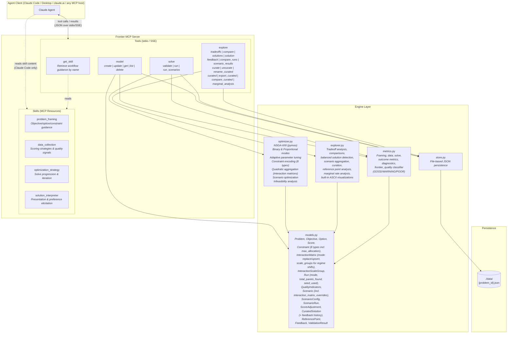
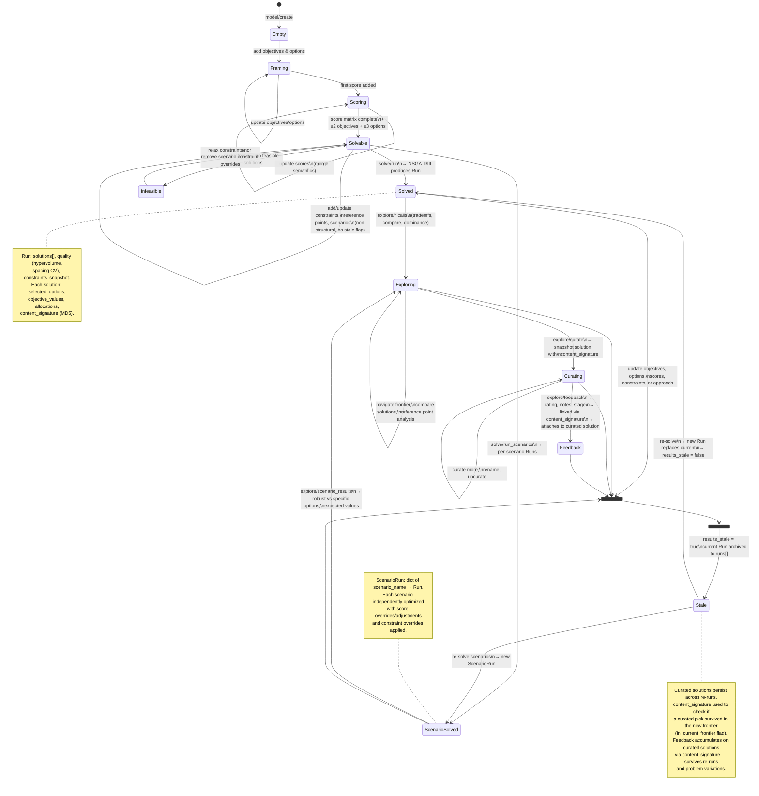
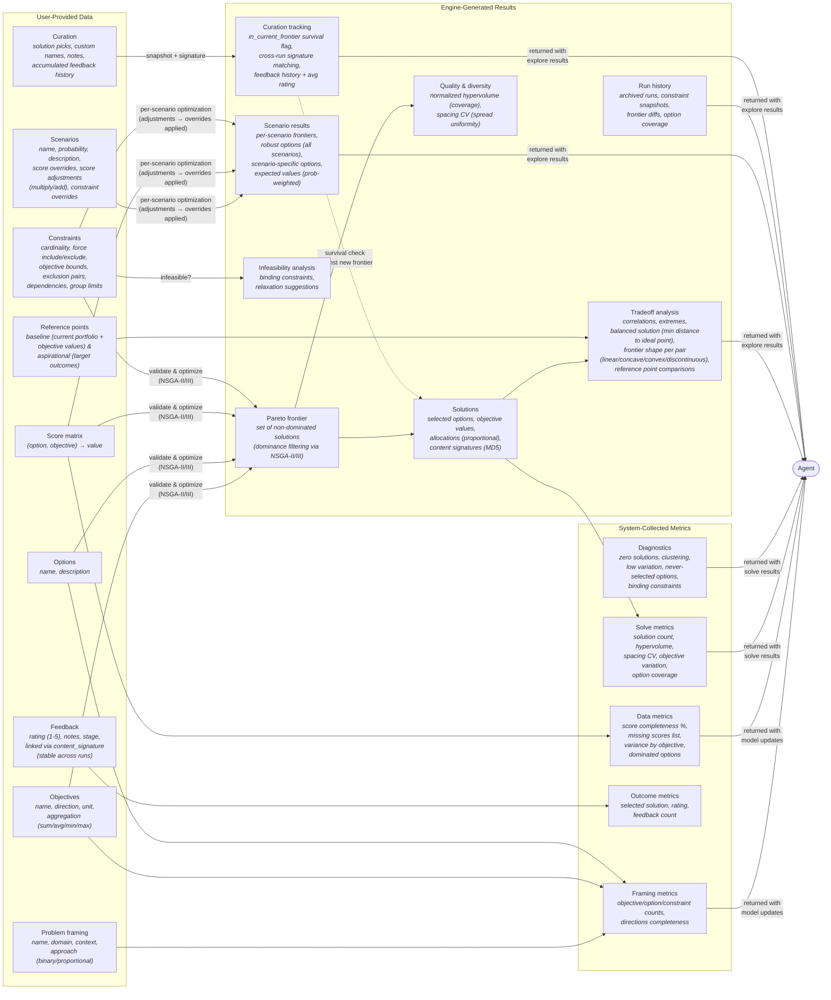

# Frontier — Architecture Reference

**Related docs:** [`best-practices.md`](best-practices.md) — skill, prompt & MCP design guidelines | [`README.md`](README.md) — user setup and usage guide | [`CLAUDE.md`](CLAUDE.md) — project instructions for Claude

## Tools & Skills Reference

### MCP Tools

Frontier exposes 4 tools — 3 domain tools with multiple actions, plus a skill delivery tool:

| Tool | Action | Purpose |
|------|--------|---------|
| **model** | `create` | Start a new optimization problem (name, domain, context, approach) |
| | `update` | Add/modify objectives, options, scores, constraints, reference points, scenarios. Merge semantics for scores; full replacement for everything else. Marks results stale on structural changes. |
| | `get` | Return problem state. Optional `section` param for targeted slices: summary, objectives, options, scores, constraints, matrices, scenarios, run, runs, curated, references. Without section: full dump. |
| | `list` | List all problems with metadata snapshots |
| | `delete` | Remove a problem and its data file |
| **solve** | `validate` | Pre-flight check: ≥2 objectives, ≥3 options, complete score matrix, feasible constraints |
| | `run` | Validate then optimize. Returns compact result — `objective_ranges`, `preview` (per-objective extremes + balanced solution by id/objective_values only), `quality`, `seed_used`, `total_pareto_found` (pre-pruning count), `frontier_complete` (bool — true when returned set is the full Pareto frontier, false when pruning truncated it), `frontier_quality` (status GOOD/WARNING/POOR with progressive gates and issues), `metrics`, `full_result_path` (disk path to complete JSON with all solutions — preferred for bulk export or artifact assembly), and `next_steps` pointer. Full solution detail also retrievable via `explore solutions` / `explore solution <id>`. Optional `mode`: "fast" (default, quick iterations) or "thorough" (final convergence). Optional `max_solutions` caps Pareto set size (default 100). Optional `seed` (int) for reproducibility; omitted = fresh random seed drawn and echoed. Auto-selects NSGA-II (2-3 obj) or NSGA-III (4+ obj). Parameters adapt to solution space size and objective count. |
| | `run_scenarios` | Independently optimize each scenario with score overrides/adjustments. Accepts optional `mode`, `max_solutions`, and `seed` (per-scenario seeds are deterministically derived so each scenario reproduces while starting from distinct initializations). |
| **explore** | `tradeoffs` | Frontier overview: total solution count, objective ranges, correlations + normalized MI per pair (MI computed when n≥15), extremes, balanced solution (ideal-point closest), inflection-point candidates (diminishing-returns boundaries), frontier shape classification per conflicting pair (linear / concave / convex / discontinuous, with confidence), binding_analysis (shadow-price rates per binding constraint — how much each objective shifts per unit of slack relaxation, derived from frontier; objective_bound / cardinality / group_limit), objective_redundancy (classification per pair using Pearson + MI, flags Pearson/MI disagreement = non-linear dependence), vs references. Optional `scenario` param targets a specific scenario's frontier. |
| | `compare` | Side-by-side comparison of 2+ solutions (shared/differentiating options, tradeoff summary). Optional `scenario` param. |
| | `solutions` | Pareto frontier listing. Default: compact (solution_id + objective_values + content_signature). Pass `detail=true` for full dump including selected_options and allocations. Optional `scenario` param. |
| | `solution` | Single solution detail with reference point analysis. Optional `scenario` param. |
| | `feedback` | Record user feedback: solution_id or content_signature, rating (1-5), notes, stage. Links to content_signature (stable across runs) and attaches to matching curated solution. |
| | `compare_runs` | Diff run history: criteria changes, frontier diffs, option coverage |
| | `scenario_results` | Per-scenario analysis with frequency-weighted option importance. Returns option_robustness sorted by importance (avg_frequency x avg_weight) with tiers: core (>50% in all scenarios), common (>25%), marginal (<25%). Also: scenario-specific options, expected values (ideal-point, probability-weighted), scenario_risk per objective (expected / worst_case / best_case / cvar_<alpha>%). Optional `cvar_alpha` (float in (0,1), default 0.2) sets the CVaR tail fraction. |
| | `curate` | Add a solution to the curated set with custom name and notes. Optional `scenario` param for curating from scenario frontiers. |
| | `uncurate` | Remove a solution from the curated set by content signature |
| | `rename_curated` | Update a curated solution's custom name |
| | `curated` | List all curated solutions with `in_current_frontier` survival flag |
| | `compare_curated` | Compare curated solutions side-by-side by content signature. Default: compact (shared/differentiating options + objective values). Pass `detail=true` for full selected_options and allocations per solution. |
| | `marginal_analysis` | Marginal rate analysis: cost-per-unit between adjacent solutions, inflection point detection (where marginal cost jumps sharply). Default summary; `detail=true` for per-pair breakdown. Optional `scenario` param. |
| **get_skill** | *(single action)* | Retrieve workflow guidance by name. Returns full skill markdown. Works with all MCP clients (unlike resources, which require client-side resource support). Available skills: `problem_framing`, `data_collection`, `optimization_strategy`, `solution_interpreter`. |

### MCP Skills (Resources + Tool)

Skills are available two ways for maximum client compatibility:
1. **`get_skill` tool** (universal) — works with any MCP client. Call `get_skill('problem_framing')` etc.
2. **MCP resources** (backward compat) — `frontier://skills/*` URIs, for clients that support resource reads.

Skills provide domain guidance the agent consults at each workflow stage:

| Skill | Purpose |
|-------|---------|
| **problem_framing** | Translate decision language into objectives/options/constraints. Covers objective vs constraint classification (principle-based, not keyword matching), hidden objective detection, approach selection (binary vs proportional — "does quantity matter?"), aggregation modes (canonical definition — sum/avg/min/max/quadratic), interaction matrices for quadratic aggregation, reference points, scenario definition, question anchors for guiding problem exploration. Cross-referenced by other skills. |
| **data_collection** | Guide score elicitation. Covers data readiness levels, anchoring techniques, batch efficiency, source evaluation, conflict resolution, score quality signals (variance, scale mismatch), aggregation implications on scoring (cross-references problem_framing), completeness drive. |
| **optimization_strategy** | Drive solve progression. Covers iteration expectations, validate→run→examine flow, constraint strategy (cross-references problem_framing for types), infeasibility response, binding constraint detection, curated solution survival tracking, run comparison, scenario interpretation, stale results and re-run judgment. |
| **solution_interpreter** | Present results without bias. Core Judgment (always apply): "never say best", five explanation dimensions, presentation order (Extremes → Balanced → Inflection → Risk → Preference), tradeoff framing, objective ranking elicitation, dominance explanation, question anchor (connect results back to user's original decision question). Presentation Refinements (situational): visualization, run diffs, reference point narration, scenario presentation, diagnostics, preference learning, curation guidance. Reference: `references/explore-diagnostics.md` for detailed field schemas of tradeoff and scenario result blocks. |

---

## 1. User Workflow

How an end-user interacts with the AI agent, which drives Frontier on their behalf.

## 2. System Architecture

MCP tools, skills, engine internals, and how they connect to the agent client.

### Skill Auto-Injection

Tool responses include the relevant skill content for the *next* workflow phase, so agents receive guidance at the right time without manually calling `get_skill()`. This is the primary delivery mechanism — `get_skill` exists as a manual fallback.

| Trigger | Injected Skill |
|---------|---------------|
| MCP connect (server instructions) | Condensed `problem_framing` + constraint schemas + scores schema |
| `model/create` response | `data_collection` |
| `model/update` (objectives/options) | `data_collection` (if not already injected) |
| `model/update` (scores hit 100%) | `optimization_strategy` |
| `solve/validate` (ready=true) | `optimization_strategy` (if not already injected) |
| `solve/run` response | `solution_interpreter` (always, on every solve) |

Re-injection of `optimization_strategy` only fires on problem *shape* changes (objectives or options). Refinements (constraints, interaction_matrices, scenarios, reference_points, approach flip, score updates) don't re-trigger — the methodology guidance hasn't changed.

### Visualization & Compaction Layers

**Built-in visualizations** — `explorer.py` renders ASCII/text visualizations inline with explore results, avoiding a separate rendering step:
- `_render_tradeoffs_viz` — scatter plot of objective pairs with labeled extremes
- `_render_parallel_coords` — parallel coordinates chart for compare and compare_curated
- `_render_scenario_viz` — robust vs scenario-specific option summary
- `_render_marginal_rates` — cost-per-unit bar chart with knee marker

**Response compaction** — `server.py/_format_explore` trims redundant bulk from explore output (e.g. strips option lists from extreme_solutions, restructures scenario_specific_options) to prevent MCP truncation while keeping the dict shape stable for consumers. `solve/run` responses are also compacted: full solution bodies are not returned inline — only objective ranges plus a preview (extremes + balanced by id/values), with a `next_steps` pointer to `explore` for full detail. The complete run payload (all solutions with allocations) is persisted to disk at `full_result_path` for bulk export and artifact assembly without token overhead.

### Evaluation Framework

`dev_temp/eval/` contains structured comparison runs — Frontier vs LLM-only vs pymoo/pyomo solver on portfolio optimization scenarios. Each run (e.g. `run_002/`, `run_003/`) is organized by scenario type (`base/`, `scenarios/`) with per-approach subdirectories (`frontier/`, `llm/`, `solver/`). Each approach produces `results.json`, `results.md`, `curated.md`, `issues.md`, and `response.md`. Runs include a top-level `comparison.md` synthesizing outcomes and a `plots/` directory with visualization scripts and generated charts (pairwise clouds, return-vol annotations, strategy migration). These artifacts validate the gap Frontier closes between unaided LLM reasoning and structured optimization.

## 3. Problem State Lifecycle

The state machine that bridges user actions (diagram 1) to data mutations (diagram 4). Shows when results go stale, runs get archived, and curated solutions are tested for survival.

## 4. Data Flow

What data is user-provided, system-collected, and engine-generated at each phase.

