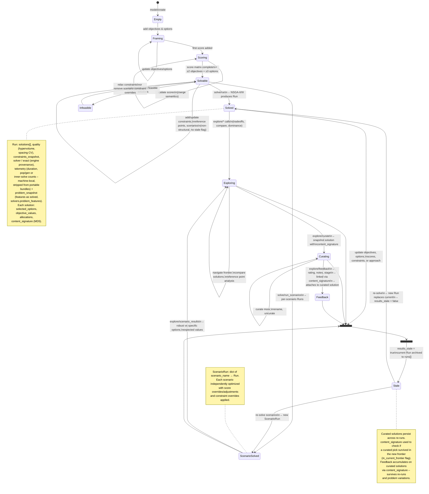
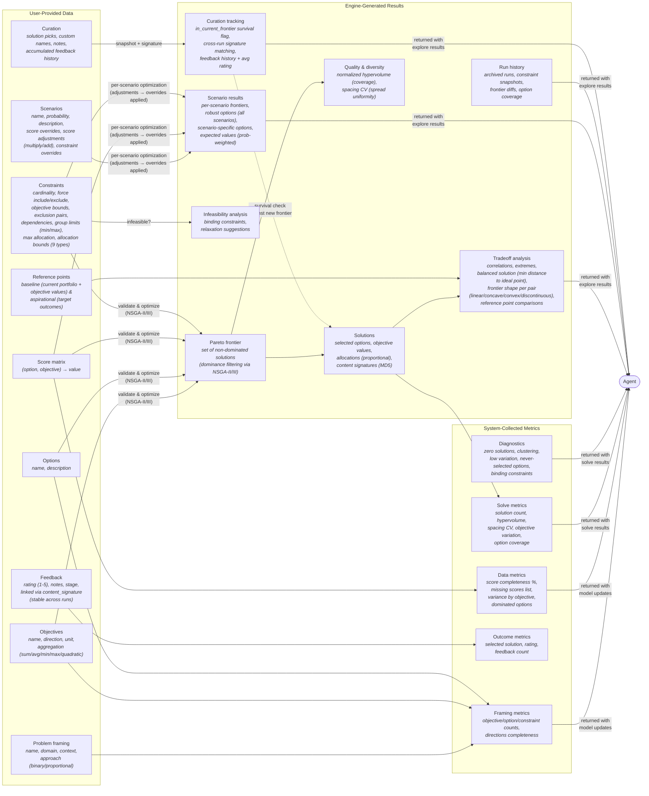

# Frontier – Architecture Reference

**Related docs:** [`best-practices.md`](best-practices.md) – skill, prompt & MCP design guidelines | [`README.md`](README.md) – user setup and usage guide

## Design Principle: Deterministic Guardrails + Human Judgment

Frontier's architecture separates what must be **deterministic** from what requires **human judgment**: the split that makes its optimization explainable and governable. Every component below sits on one side of this line.

- **Deterministic guardrails (engine layer).** Computed from problem state, not model output, so the same inputs always yield the same result. Hard-constraint enforcement during search (`optimizer.py`, 9 constraint types – never violated); Pareto dominance filtering (NSGA-II/III); seeded reproducibility (`seed` / `seed_used` – same inputs + seed reproduce the exact frontier, in- and cross-process; `optimizer._seeded_rng_fallback` makes pymoo's otherwise-unseeded survival/selection RNG deterministic); pre-solve constraint-conflict validation (`optimizer._check_constraint_conflicts`); infeasibility analysis with relaxation suggestions; and frontier quality gates (`metrics.frontier_quality` → GOOD/WARNING/POOR). `metrics.py` states the contract directly: "deterministic signals from problem state … not LLM-generated."
- **Human judgment (agent + skills layer).** The skills steer the two calls that stay with the human – *framing* (objectives vs. hard constraints) and *selection* (which non-dominated solution to commit to). `solution_interpreter` enforces "never say best" and **traceable claims**: every quantitative statement must trace to returned data (a score, an objective value, a shadow price, a dominance relation), so a stakeholder can audit the reasoning line by line. Curation is the human's act of choosing; the engine records it but never makes it.

**Tighter optimality is an optional tier of the same determinism.** The default NSGA path is deterministic and reproducible but *heuristic* – it approximates the frontier. On supported problem shapes the agent can elect an exact-solver backend ([§ Solver Backends](#solver-backends-pluggable)) that makes each frontier point *optimal to a 0.1% gap* (a certified zero gap with `exact=true`) rather than approximate – a stronger form of the engine-side guarantee. Choosing *when* to pay for that **exact pass** is itself the human/skill judgment (the `optimization_strategy` skill guides it); the exact run, once elected, is deterministic. So exact solvers don't add a third layer – they deepen the deterministic guardrail and hand the agent one more judgment call.

The layers in §2 realize this split: the **Engine Layer** is the deterministic core, the **Skills** are the judgment scaffold, and the **MCP Tools** are the interface between them. Read the rest of this document through that lens.

## Tools & Skills Reference

### MCP Tools

Frontier exposes 4 tools – 3 domain tools with multiple actions, plus a skill delivery tool:

| Tool | Action | Purpose |
|------|--------|---------|
| **model** | `create` | Start a new optimization problem (name, domain, context, approach) |
| | `update` | Add/modify objectives (≥2 enforced; 2–7 is the designed envelope), options, scores, constraints, reference points, scenarios. Merge semantics for scores; full replacement for everything else. Marks results stale on structural changes. |
| | `get` | Return problem state. Defaults to the `summary` slice (counts + status flags — always small). Optional `section` for targeted slices: summary, objectives, options, scores, constraints, matrices, scenarios, run, runs, exact_run, curated, references — or `full` for the complete dump (opt-in; can exceed token caps on large models). |
| | `list` | List all problems with metadata snapshots |
| | `delete` | Remove a problem and its data file |
| | `save` | Save a problem to the user's library (`saved/<name>/`) in the portable examples format. Params: `problem_id`, `save_as` (name; defaults to a slug of the problem name). Always includes `solutions.json` when the problem has a run. |
| | `load` | Load a problem by name in the portable format, resolving `saved/` first then bundled `examples/` (a save shadows a like-named example). The response names the serving `library` (`saved`\|`examples`) and carries a `note` when a saved copy is shadowing a bundled example, so a stale save can't silently stand in for the pristine bundle. Mints a fresh `problem_id`, registers it in the store, restores scenarios + prior results. Omit `source` to list available names. |
| **solve** | `validate` | Pre-flight check: ≥2 objectives, ≥3 options, complete score matrix, feasible constraints. Also returns a `solvers` block – which engines are `available` in this environment, whether the optional exact backends `exact_fits_shape` for this problem, and an advisory `scale` block (`{n_options, band, note}`, band `interactive`/`background`/`needs_routing`; measured-boundary constants beside the shape gate in `solvers/__init__.py`) that routes large problems toward the fitting posture – fast mode + `status` polling, a `time_limit`, curated-scope certification – never warning users off scale; demo-sized problems show `interactive` with no note, and readiness is unchanged (advisory only). |
| | `run` | Validate then optimize. Returns compact result – `objective_ranges`, `preview` (per-objective extremes + balanced solution by id/objective_values only), `quality`, `seed_used`, `total_pareto_found` (pre-pruning count), `frontier_complete` (bool – true when returned set is the full Pareto frontier, false when pruning truncated it), `frontier_quality` (status GOOD/WARNING/POOR with progressive gates and issues), `metrics`, `full_result_path` (disk path to complete JSON with all solutions – preferred for bulk export or artifact assembly), and `next_steps` pointer. Full solution detail also retrievable via `explore solutions` (`solution_id=` for one). Optional `mode`: "fast" (default, quick iterations) or "thorough" (final convergence). Optional `max_solutions` caps Pareto set size (default 100). Optional `seed` (int) for reproducibility (same inputs + seed → same frontier; echoed as `seed_used`); omitted = fresh random seed drawn and echoed. Auto-selects NSGA-II (2-3 obj) or NSGA-III (4+ obj). The evolutionary search never proposes the empty plan — a search default (implicit cardinality floor of 1), not a model constraint: `explore audit`, slate re-scoring, and the exact backends judge the model as written, where a model with no cardinality floor legally permits empty. Parameters adapt to solution space size and objective count. Optional `solver` selects the engine – default NSGA (evolutionary, any shape) or an opt-in exact backend `"highs"`/`"cuopt"` (each frontier point optimal to a 0.1% gap on supported shapes, zero-gap with `exact`; see *Solver Backends*); the engine that ran is echoed as `solver_used`. Optional `exact` (bool) certifies each **MILP** inner solve to a zero gap (no-op on the always-exact QP/LP and on the default NSGA path). Optional `scope` (exact backends, any supported shape) picks how the overlay is produced: `"curated"` (default) progressively certifies the existing NSGA `run`'s frontier points (the lean explore-then-certify path; falls back to a full pass when there's no run yet), `"full"` runs the exact solver on every NSGA evaluation (an exact-*guided* search); `"fill_gaps"` is targeted completion of an EXISTING overlay – re-solves only the gap-region witnesses `explore certify`'s `completeness` block detects and merges them in (needs a prior `run` + `exact_run`, fresh results, and the overlay's own backend; `exact` is inherited so a fill never demotes the overlay's certification; a gap whose inner solve hits its budget is discarded and reported – `fill.unfilled` count + `fill.unfilled_witness_ids` – never merged as an uncertified incumbent; no-op on a complete overlay). The mode that ran is echoed as `overlay_scope`. A requested exact solver that is uninstalled or ill-fitting returns a clear error rather than silently falling back. **Long runs execute in the background** (see *Long-running solves*): the response is either the compact frontier result (fast solves, unchanged) or a `{status:"running", job_id}` handle to poll via `solve status`. Optional `time_limit` (s) caps wall-clock – the run stops at its budget or the cap, whichever first, returning a best-so-far frontier flagged `time_limited` (echoed on the result). Optional `wait_seconds` tunes the inline wait before a handle is returned (0 = return a handle immediately); on `status` it long-polls up to the ~10s inline budget (see the `status` row). |
| | `run_scenarios` | Independently optimize each scenario with score overrides/adjustments. Accepts optional `mode`, `max_solutions`, and `seed` (per-scenario seeds are deterministically derived from the parent so each scenario reproduces while starting from a distinct initialization), plus `time_limit` / `wait_seconds`. Also background-dispatched, same as `run`. |
| | `status` | Poll a background solve by `job_id` (from a `run`/`run_scenarios` that returned `status="running"`). Optional `wait_seconds` long-polls: the call holds until the job finishes or the budget lapses (capped at the ~10s inline budget — sync tools share the event loop), so one poll per wait window replaces rapid instant-return re-polling. Returns `status="running"` (with `elapsed_s` + a `label`) until the solve finishes, then the full solve result (with the `solution_interpreter` skill, injected once per problem at delivery). A `status="stale"` result means the problem's solve-inputs were edited mid-solve, or (progressive certify) a new solve replaced the frontier being certified – nothing was overwritten; re-run. |
| **explore** | `tradeoffs` | Frontier overview: total solution count, objective ranges, correlations + normalized MI per pair (MI computed when n≥15), extremes, balanced solution (ideal-point closest), inflection-point candidates (diminishing-returns knees, each with a jump_factor + one-line rationale; slopes upgrade to solver-exact duals when the exact path attached them), frontier shape classification per conflicting pair (linear / concave / convex / discontinuous, with confidence), binding_analysis (shadow-price rates per binding constraint – how much each objective shifts per unit of slack relaxation, derived from frontier; objective_bound / cardinality / group_limit), objective_redundancy (classification per pair using Pearson + MI, flags Pearson/MI disagreement = non-linear dependence), vs references. Optional `scenario` param targets a specific scenario's frontier; optional `source="exact"` retargets analysis at the `exact_run` overlay instead of the default NSGA `run` (threaded through compare / solutions / curate / marginal_analysis too). Every analytics result (tradeoffs / compare / solutions / marginal_analysis) echoes `frontier_source` (`{run_id, solver, kind: heuristic\|exact}`) so a dropped or omitted `source` can't pass a heuristic frontier off as exact; a heuristic frontier served while an exact overlay exists also flags `exact_overlay_available`. |
| | `sensitivity` | Solver-exact duals from an exact continuous run (QP mean-variance or LP allocation): `where_to_invest` (constraint shadow prices, ranked – reported in the solver's cost sense: the price a binding constraint charges the optimized objective per unit of tightening, so positive always means tighter hurts, whichever direction the objective optimizes) + `near_misses` (unheld options by reduced cost, closest first) + `capped_options` + `floored_options` (options pinned at an `allocation_bound` floor — the commitment's price per point of allocation; `where_to_invest` levers for model-level `objective_bound` constraints carry role `model_bound`, named for the bounded objective) + `frontier_shadow_price_trend` (evenly downsampled past 40 points, endpoints kept — `frontier_shadow_price_trend_elided` says what was thinned), anchored on a reference solution (default balanced; `solution_id` overrides). The *exact* counterpart to `binding_analysis`; falls back to the frontier-inferred binding analysis on heuristic/MILP runs. Tagged `source=solver_exact｜frontier_inferred`, echoes `frontier_source` (run provenance, like the other analytics actions), and names the `optimized_objective` (the ε-constraint primary the duals are measured against — interpretations anchor on it by name); ends with `suggested_scenarios` seeded from the top *priced* levers on either path (duals rank, scenarios quantify — copy a seed's `motivated_by` onto the scenario so `scenario_results` cites it; absent when nothing is priced at the anchor, e.g. every dual 0.0 at a corner); continuous (QP/LP) only (integer/MILP solutions have no exact duals). |
| | `compare` | Side-by-side comparison of 2+ solutions (shared/differentiating options, tradeoff summary) — by `solution_ids`, or by `signatures` to compare the curated set (absorbs the old `compare_curated`). Optional `scenario`, `detail`. |
| | `solutions` | Pareto frontier listing — or one solution's detail (with reference-point analysis) via `solution_id` (absorbs the old `solution`). Default: compact list (solution_id + objective_values + content_signature); `detail=true` for the full dump. Optional `scenario`. |
| | `feedback` | Record user feedback: solution_id or content_signature, rating (1-5), notes, stage. Links to content_signature (stable across runs) and attaches to matching curated solution. |
| | `compare_runs` | Diff two runs: criteria changes, frontier diffs, option coverage. Defaults to current-vs-previous run; `run_ids` (2+) overrides with explicit history. |
| | `certify` | Audit the exploratory NSGA frontier against the exact overlay. **No params**: audits the current `run` against the `exact_run` overlay (solve, then solve with an exact solver, then certify). It is **frontier-level** — the certificate covers the whole frontier (curated finalists included), so it takes no solution scope: passing `signatures`/`solution_ids` returns a redirect (the finalists are already certified by the whole-frontier audit; use `compare signatures=` for a head-to-head), not a silently unscoped result. Optional `run_ids` = exactly two (one NSGA + one exact, order-free – exact auto-detected by its solver) override with explicit historical runs. Returns a solver-agnostic certificate: `dominance_audit` (which NSGA points an exact solve dominates + fraction), `coverage` (hypervolume the overlay reclaims over NSGA – `reclaimed_fraction`), `completeness` (the mirror audit – hypervolume the heuristic holds that the exact sweep never sampled; verdict `complete`/`under_covered` with witness-named `gap_regions` + a stated `noise_floor`, routing to `solve scope="fill_gaps"`; cross-linked with `coverage` via `mirror`), `invariant` (NSGA never dominates an exact point), `corner_sharpening` per objective (exact vs NSGA best, status sharpened/matched/under-sampled, is_risk_corner), `headline_corner`, `quality_gates` (degenerate/pinned certified points flagged — optimal ≠ actionable), and a `recommendation`. See *Solver Backends*. |
| | `audit` | Witness / feasibility auditor over the **whole feasible space** (binary problems, HiGHS) – the feasibility-side sibling of `certify`, reasoning about every feasible plan rather than the non-dominated frontier. **No prior solve required**: reads the model's constraints directly. Optional `audit_property` (a constraint-shaped dict, same vocabulary as model constraints – or a **list** of them, proving the conjunction: each conjunct gets its own feasibility solve, the payload adds a per-`properties` breakdown, and a violation names the `violated_property`; a floor-only `group_limit` property may omit `max`, which defaults to the group size). With no property → feasibility probe (`verdict` feasible + a witness plan / no_feasible_plan – the exact form of `validate`'s pre-solve check). With a property → proves a guarantee: it holds for **every** feasible plan (`verdict` holds, the negation infeasible across the whole region) or returns a concrete counterexample (`verdict` violated + `witness`), plus holds_vacuously / inconclusive (raw solver status attached — a stopped solve is not evidence either way), the `feasible_region` the verdict is conditional on (pinned as constraint counts-by-type + a content fingerprint, with `model get` for full detail — the verbatim 62-constraint echo dominated the payload), and a `recommendation`/`next_steps`. On no_feasible_plan / holds_vacuously it also attaches `conflicts`: a minimal set of the user's named constraints that cannot all hold together (deletion filtering; leads to relax, never auto-relaxed — the same set rides `solve`'s empty-frontier infeasibility analysis on fitting shapes). Objectives enter the encoding only via `objective_bound` rows, so sum aggregation is required **only for bound-referenced objectives** – a quadratic/avg objective no bound touches still audits. An unfit shape (non-binary / a bound on a non-sum objective / HiGHS missing) returns a tool error, matching `solve`'s exact gate – no "unsupported" verdict. See *Solver Backends*. |
| | `scenario_results` | Per-scenario analysis with frequency-weighted option importance. Returns option_robustness sorted by importance (avg_frequency x avg_weight; binary selections carry no allocations, so their rows omit avg_weight/importance and rank by frequency) with tiers keyed on the WORST per-scenario frequency (`tier_rule` in the payload states it): core (>50% in every scenario), common (>25% worst-case or present in all), marginal (the rest); at portfolio scale the ranked table truncates to the top 60 with an `option_robustness_elided` summary (count, tiers, pointer) so the payload stays inside the MCP inline cap — mirrored into `viz_data`. Also: scenario-specific options, expected values (ideal-point, probability-weighted), scenario_risk per objective (expected / worst_case / best_case / cvar_<alpha>%), and `regret` (scenario minimax-regret per solution + `minimax_choice`, with scenario-infeasible solutions flagged – a distinct lens from CVaR: "how much worse than the best achievable, in hindsight"; each base solution re-evaluated under every scenario via `optimizer.score_slate`, since scenarios are independent frontiers; a **total-wipeout scenario** — zero feasible base plans, counted in `survivors_by_scenario` and lifted into each `per_scenario` entry as `base_plans_feasible`/`base_plans_total` — is **excluded from the minimax ranking** and named in `wipeout_scenarios` + `wipeout_note`, so `max_regret`/`mean_regret`/`minimax_choice` and the `per_objective` regrets span the *ranked* scenarios only while `by_scenario` still reports every scenario and `feasible_in_ranked` sits beside `feasible_in_all` per row; when every base solution saturates at max regret across the ranked scenarios the block sets `saturated` + a saturation note and omits `minimax_choice` rather than nominate an all-tied pick — the two findings can co-occur — and `per_solution_total` counts beyond the listed top 20; when finalists are curated the block adds `regret.curated` — the shortlist re-scored under every scenario with the same normalization and ranked-scenario set (rows + its own `minimax_choice`), so the user's actual picks, including exact-overlay re-curations, rank beside the base frontier's; absent when nothing is curated). Each `per_scenario` entry restates `varies` + `held_fixed` (what the scenario changes vs. inherits — constraint_overrides replace the whole base set, and the restatement says so) and echoes `motivated_by` when the scenario was seeded from a sensitivity suggestion. Optional `cvar_alpha` (float in (0,1), default 0.2) sets the CVaR tail fraction. |
| | `scenario_frontiers` | Per-scenario Pareto frontiers overlaid for visualization. `viz_data` colors each scenario's frontier for the web UI's parallel-coordinates overlay and emphasizes curated picks (bold, colored by the scenarios they're feasible in); ASCII surfaces a per-scenario objective-range table. Shows how the achievable tradeoffs shift across futures. |
| | `curate` | Pin a solution to the curated set with custom name and notes (optional `scenario` for scenario frontiers); the response carries a `quality` gate (GOOD/WARNING/DEGENERATE — empty plan, single-option concentration, allocations pinned at bounds — surfaced, never blocking) — and manage existing pins: `remove=true` unpins, `rename="…"` renames, both by content signature (absorbs the old `uncurate` / `rename_curated`). |
| | `curated` | List all curated solutions with `in_current_frontier` survival flag — or render the handoff export with `format="markdown"\|"csv"` (columns: name, content_signature, quality, objective values, selected_options; invalid format errors cleanly; absorbs the old `export_curated`); listings and exports carry each finalist's `quality` gate. |
| | `marginal_analysis` | Marginal rate analysis: cost-per-unit between adjacent solutions, inflection point detection (where marginal cost jumps sharply). Default summary; `detail=true` for per-pair breakdown. Optional `scenario` param. |
| | `composition` | Mine the solution set (knowledge-discovery pillar): per-option `selection_count`/`selection_pct` (consensus vs distinctive – also surfaced on `tradeoffs`, and per-option on `solution` via `option_context`), `co_occurrence` lift (complements/substitutes), `design_principles` (always / never / region-bound), decision-space `clusters` (strategy families, each with defining options + objective signature – clustering in decision space, not objective space), and `feedback_rules` (rules separating liked from disliked solutions when feedback exists → candidate latent constraints). Operates on the active frontier, or a curated subset via `solution_ids` / `signatures`. |
| **get_skill** | *(single action)* | Retrieve workflow guidance by name. Without `section`: the skill's core (SKILL.md). With `section=<heading>`: exactly that section, resolved across the core **and** the skill's `references/` files — the cheap recovery path every decision response's `guidance_pointer` names. Unknown sections error with the available titles. Works with all MCP clients (unlike resources, which require client-side resource support). Available skills: `problem_framing`, `data_collection`, `optimization_strategy`, `solution_interpreter`. |

**Rendering surfaces.** `explore` actions (and `model get` summary) emit both an ASCII `visualization` for chat / coding-agent clients and a structured `viz_data` payload for chart-rendering surfaces. The web UI renders `viz_data` via Plotly and D3 (per-chart split in § Visualization & Compaction Layers): frontier solutions adapt to dimensionality (2 obj → 2D scatter, 3 → 3D scatter or a 2D scatter colored by a user-chosen third objective, ≥4 → parallel coordinates), with a per-chart toggle (3D / 2D-color / parallel-coordinates, as the dimensionality allows); scenarios overlay as colored parallel coordinates with curated picks emphasized, and the formulation renders as a typed card. Clicking a point (or brushing parallel coordinates) curates it through the agent.

### MCP Skills (Resources + Tool)

Skills are available two ways for maximum client compatibility:
1. **`get_skill` tool** (universal) – works with any MCP client. Call `get_skill('problem_framing')` etc.
2. **MCP resources** (backward compat) – `frontier://skills/*` URIs, for clients that support resource reads.

Skills provide domain guidance the agent consults at each workflow stage:

| Skill | Purpose |
|-------|---------|
| **problem_framing** | Translate decision language into objectives/options/constraints. Covers objective vs constraint classification (principle-based, not keyword matching), hidden objective detection, approach selection (binary vs proportional – "does quantity matter?"), aggregation modes (canonical definition – sum/avg/min/max/quadratic), interaction matrices for quadratic aggregation, reference points, scenario definition, question anchors for guiding problem exploration. Cross-referenced by other skills. The constraint / interaction-matrix / scenario JSON shapes live in `references/schemas.md` (fetched when building a payload), keeping the core to framing judgment. |
| **data_collection** | Guide score elicitation. Covers data readiness levels, best-worst anchoring, batch efficiency, source evaluation, conflict resolution, score quality signals (variance, scale mismatch), aggregation implications on scoring (cross-references problem_framing), score provenance/attribution, completeness drive. |
| **optimization_strategy** | Drive solve progression. **Core organized around the solve loop — validate → run → examine → iterate → certify.** Iteration expectations, background-job literacy, mode + solver selection (incl. the staged exact-certify trigger and engine table), solve-time constraint judgment (don't over-constrain; constraint *types* owned by problem_framing), infeasibility response, status literacy, binding constraint detection, sensitivity-vs-scenario, reproducibility, curated solution survival, run comparison, stale results and re-run judgment. Scenario-result robustness interpretation is owned by `solution_interpreter` (*Scenario Results Presentation*). Deep exact-solver narration (claim calibration, gate declines + redefines, `exact=true`) lives in `references/exact-solvers.md`, fetched as the *Exact Solvers — Depth* section. |
| **solution_interpreter** | Present results without bias. Core Judgment (always apply, injected): "never say best", traceable claims, five explanation dimensions, presentation order (Extremes → Balanced → Inflection → Risk → Preference), tradeoff framing, objective ranking elicitation, dominance explanation, question anchor. The 22 situational *Presentation Refinements* (certificate reading, audit reading, exact sensitivity, scenario presentation, composition mining, curation, the stakeholder writeup + why-triplet, diagnostics, …) live in `references/presentation-refinements.md` — fetched per section via `get_skill(…, section=…)` at the moment each output is presented; `references/explore-diagnostics.md` holds raw field schemas. |

---

## 1. User Workflow

The user describes a decision in plain language; the agent translates it into Frontier's model and reads the results back in the user's terms, driving the loop: **frame** (objectives, options, constraints, scenarios; `model create/update`) → **score** (`model update`) → **explore** (the approximate solve via `solve run`/`run_scenarios`, then `explore tradeoffs`/`scenario_frontiers`; measured by coverage) → **curate** (`explore curate`, narrowing to the finalists worth defending) → **certify** (the exact solve on supported shapes via `solve solver="highs"|"cuopt"` then `explore certify`; measured by the optimality gap) → **examine** (`explore sensitivity`/`scenario_results`/`audit`/`composition`, read back in decision terms) → **decide** (the user commits; `explore curated` renders the handoff). The solve is embedded in explore (approximate) and certify (exact); the agent iterates throughout (refine, re-solve, `explore compare_runs`). Each phase transition auto-injects the matching skill (§ Skill Auto-Injection), so the agent gets framing judgment before modeling, scoring judgment before data entry, solve strategy before running, and presentation judgment before narrating results. The full per-action contract is the tools table above.

## 2. System Architecture

Three layers between the agent client and the data on disk:

- **MCP server** (`mcp_server/`, FastMCP from the official `mcp` Python SDK, stdio/SSE) — `server.py` owns the 4 tools (`model`, `solve`, `explore`, `get_skill`), `frontier://skills/*` resources, response compaction, and the optional bearer gate; `guidance.py` owns skill loading/injection state and the decision guidance pointers; `jobs.py` owns the background solve jobs.
- **Engine** (`engine/`) — `models.py` (the canonical `Problem`: objectives, options, scores, 9 constraint types, interaction matrices, scenarios, runs, curation, feedback), `optimizer.py` (NSGA-II/III via pymoo; binary + proportional modes, constraint encoding, quadratic aggregation, scenario optimization, infeasibility analysis), `explorer.py` (tradeoff/scenario/curation analytics, certification, sensitivity, ASCII renderers), `viz.py` (the structured `viz_data` chart builders the web UI mirrors), `metrics.py` (deterministic framing/data/solve metrics, `frontier_quality` gates), `store.py` (atomic JSON persistence to `data/{problem_id}.json`), `problem_io.py` (portable save/load bundles).
- **Exact backends** (`solvers/`) — `highs_backend.py` (CPU) and `cuopt_backend.py` (GPU) behind one scalarization engine (`_scalarization.py`) and one shape/availability gate (`__init__.py`); opt-in per run via `solve(solver=…)` (§ Solver Backends).

The skills (`skills/*/SKILL.md` + per-skill `references/`) are data, not code: markdown the server injects and serves, carrying the judgment layer described above.

### Problem Persistence: Live Store vs Portable Bundles

A problem persists two ways: the **live store** (`store.py` → `data/{problem_id}.json`) holds the full canonical `Problem` keyed by UUID (session state – a stateful deployment just mounts a disk here; the bundled render.yaml blueprint deliberately doesn't yet, so hosted-beta state is ephemeral); writes go through an **atomic** `save` (temp file + `os.replace`), so a concurrent reader never sees a half-written file and a background solve worker can persist without tearing a foreground edit (see *Long-running Solves*). **Portable bundles** (`problem_io.py`, the `model save` / `load` format the [`examples/`](examples/) use) split it across `problem.json` (definition), `scores.json` (data), and `solutions.json` (results, written when solved). `save` writes to a gitignored `saved/` library; `load` resolves a name against `saved/` then `examples/`, minting a fresh `problem_id`. `problem_io` is also where the examples' top-level `scenarios` list is bridged to `scenario_config` (`enabled=True`) – a naive `Problem(**problem_json)` would drop scenarios, since the field is `scenario_config` and pydantic ignores unknown keys.

### Solver Backends (Pluggable)

The default solve path is pymoo's NSGA-II/III for all problem shapes. Two **opt-in exact-solver backends** sit alongside it as an **optional audit / certification layer** over that heuristic exploration, gated so the default path never imports either (each imports its solver lazily, so the modules load whether or not that solver is present). Both share **one NSGA-scalarization engine** ([`solvers/_scalarization.py`](solvers/_scalarization.py)): NSGA-II evolves epsilon-constraint scalarization targets – and, under a cardinality/group cap, an asset-selection priority vector – while an injected **inner solver** solves each scalarized single-objective problem to optimality, and the Pareto frontier is assembled from those exact inner optima. NSGA explores the scalarization space; the inner solver makes each evaluated point optimal to a 0.1% gap instead of heuristic. The two backends differ **only** in that injected inner solve, and both return the engine's exact `Run` / `Solution` shape – so explorer, metrics, and store need zero changes. Additive, gated, reversible. The epsilon sweep is kept attainable at both ends: each objective's tight sweep bound is its **box-feasible extreme** (`_box_extreme` – floors first, then the best assets filled to their caps) rather than the best single-asset coefficient, so under per-option caps the epsilon box stays inside what any portfolio can reach; the QP loose end spans the **full payoff-table range** when several linear objectives sweep (each objective down to its box-feasible worst – frontier points can hold one objective worse than its min-variance value in exchange for another, and the overlay must reach them; the single-linear mean-variance case keeps its loose end at the min-variance value, where anything slacker only re-derives the mv point); and every QP/LP scalarization passes a **screen-and-back-off** (`_feasible_eps`: budget coverage plus per-target attainability on the decoded support; a target in the razor band just inside its attainable extreme backs off to the band edge — epsilon targets are sweep parameters the engine may nudge, and loosening can only enlarge the feasible region, so no feasible scalarization is ever lost while a target exactly AT the extreme passes through untouched) before a solver model is built: unattainable targets are declined in-engine, and the razor-band geometry where an active-set QP can cycle on degenerate ties (the Linux-wheel hang) is deleted rather than merely deadline-bounded. In OR terms this is the *sequential-collaborative* matheuristic pattern – the heuristic explores, the exact solver certifies – reusing the same optimality-gap-against-a-bound a MILP solver already reports for its own incumbent, here applied across a Pareto front rather than a single objective.

**The exact run is an auditor, not a replacement.** Because each inner solve is optimal for its scalarization, overlaying exact points on the heuristic frontier can only **confirm or improve** it, never worsen it – the invariant *NSGA never dominates an exact point* (strict for a MILP certified with `exact=true`; a default bounded MILP run accepts gap/time-limited incumbents a full NSGA search can legitimately edge out, and for the QP rare violations can only come from integer-rounding the continuous optimum to whole-percent allocations — the certificate's invariant note names whichever cause applies, never a heuristic win). In practice exact does three things: it **sharpens the convex risk/variance corner**: the flat convex bowl where heuristics wobble and a QP is exact, i.e. the minimum-risk portfolio a risk-averse decider hinges on (min-volatility, most-diversified sourcing, firmest grid); it **audits heuristic slack** by flagging NSGA points shown as efficient that an exact solve dominates; and on a binary MILP it returns the **optimal subset** for its targets (to a 0.1% gap, certified zero-gap with `exact=true`). Every exact overlay also carries **anchor corners** – one lexicographic anchor solve per objective (the classic ε-constraint payoff-table step, tie-broken by the primary/risk minimand) – so the frontier's per-objective extremes are always sampled regardless of the EA's ε-target sampling budget, and a corner can't come back "short" of NSGA just because the sweep under-covered it. Anchors flow through the same inner solves, dedupe, and dominance filter as every other point. Under a cardinality/group cap, **LP** anchors carry a priority tail selecting each objective's top-K support — greedy-optimal for a linear objective, so the capped corner stays exact (pure cardinality; group caps inherit the EA's decode semantics) — while **QP** anchors are skipped there: the min-variance corner has no greedy-derivable support, and the capped QP path's seeded population owns corner coverage ([`tests/test_anchor_corners.py`](tests/test_anchor_corners.py)).

**Agent-selectable per run (provable optionality).** Solver choice is a **per-run decision made by the agent**: there is one selection mechanism, the `solver` argument, no deployment-wide env toggle. Solver choice is problem-shape- and workflow-phase-dependent (explore with the EA, certify a finalized pick with an exact solver), so a global default would fight that flow rather than help it. `solve(solver="highs"|"cuopt", exact=…)` threads through `optimizer.optimize(..., solver=…)`; omitted (or `"nsga"`) runs the default evolutionary search. [`solvers/__init__.py`](solvers/__init__.py) owns the two pure checks both the tool and `optimize()` consult – `available_solvers()` (probes importability with `importlib.util.find_spec`, so it answers without importing the solver) and `exact_solver_fits(problem)` (the shared shape gate, one scope for both backends: **binary selection** with every objective `sum`-aggregated – the MILP is linear in the 0/1 vars, so `avg` (fractional over a variable-size pick), `min`/`max`, and `quadratic` (nonlinear) are each declined *with a redefine hint* rather than silently optimized as a sum; or **proportional mean-variance**: a **minimize**-direction `quadratic` *risk* objective backed by an interaction matrix alongside `sum`/`avg` linear objectives, with `min`/`max` (nonlinear) and a *maximize* quadratic (non-convex) declined; or **proportional purely-linear**: ≥2 `sum`/`avg` objectives and no quadratic term → an exact multi-objective LP). On the proportional shapes the gate also declines the *combinatorial membership* constraints a convex QP/LP can't express — exclusion pairs, dependencies, cardinality floors above 1, and group-limit floors — while force_include/force_exclude stay in scope (they fold into the variable box as a 1% activity floor / 0 cap), model `objective_bound`s ride every inner solve as linear rows, and a MAX bound on the quadratic risk objective is enforced exactly by post-filtering (the inner solve minimizes it, so a violating point proves its targets infeasible; a MIN floor on it is non-convex and declines). The `solve` tool guards on both before running and returns an actionable error if the requested solver is uninstalled or ill-fitting – it never silently degrades to NSGA, so a result that claims optimality always ran an exact engine. Every run records `Run.solver` / `Run.exact` and echoes `solver_used` in the response, keeping the frontier traceable to the engine that produced it (the same "traceable claims" contract the skills enforce). The `optimization_strategy` skill's *Exact Solvers* section carries the agent-facing workflow guidance: when to upgrade from EA exploration to an exact-audited frontier, and how to narrate it without over-claiming.

The two backends are **first-class and co-equal**: the same auditor engine over two inner solves, one GPU and one CPU; pick by the hardware on hand, not by tier.

- **NVIDIA cuOpt** (`solvers/cuopt_backend.py`, `solver="cuopt"`) – the **GPU exact backend**: a convex min-variance **QP** for proportional mean-variance portfolios, a 0/1 **MILP** for binary selection, and an exact **LP** for purely linear proportional allocation. The continuous duals (QP + LP shadow prices / reduced costs, read via `get_dual_solution` / `get_reduced_cost`) are surfaced through `explore sensitivity`, at parity with HiGHS. The QP has two equivalent builds – the term-by-term high-level `Problem` API (`_solve_qp_cuopt`, GPU-verified) and a scalable matrix `data_model` / CSR build (`_solve_qp_cuopt_matrix`) that drops the O(n²) Python-expression construction for a dense covariance to one vectorised conversion; both pack the same covariance, so they return the same optimum (the `_USE_MATRIX_QP` flag selects; the matrix build is the default, GPU-confirmed equivalent to the term-by-term path). Needs `cuopt-cu12` + a GPU, so it runs in Colab. cuOpt MILP solves run in **deterministic mode** (`CUOPT_MIP_DETERMINISM_MODE`) – the mode Frontier's seeded-reproducibility contract needs (cuOpt's default *opportunistic* mode can return a different optimum run-to-run), which as a side effect takes the *sequential* LP root relaxation: the epsilon sweep proposes infeasible corners the engine expects (scored dominated), and cuOpt's *concurrent* root solve aborts the process (`std::terminate`, an uncatchable kernel crash) on an infeasible relaxation, whereas the sequential path returns `Infeasible` as a clean `ok=False` like HiGHS – a configuration fix, not a workaround.
- **HiGHS** (`solvers/highs_backend.py`, `solver="highs"`) – the **CPU exact backend**: the same engine with HiGHS inner solves. Exact **MILP** for binary selection with additive (`sum`) objectives (every Frontier combinatorial constraint – cardinality, force in/out, dependency, exclusion, group limit, objective bound – is linear-integer, handled exactly; the [`capital_project_selection_300`](examples/capital_project_selection_300) showcase) and convex **QP** for mean-variance portfolios (linear `sum`/`avg` objectives plus the quadratic risk term); and exact **LP** for purely linear proportional allocation (a linear objective optimized, the rest ε-constrained, with shadow prices + reduced costs). HiGHS can't solve MIQP, but never has to: under a cardinality/group cap the EA picks *which* assets are eligible and HiGHS solves the continuous QP on that support exactly. The solver is a plain `pip install highspy` (CPU, cross-platform, no special index, no GPU), so the exact path – and the shared NSGA engine with it – runs and is tested on the same machine as the engine ([`tests/test_highs_backend.py`](tests/test_highs_backend.py)). Each QP/LP inner solve carries a safety deadline (`_PROP_TIME_LIMIT`, the convex sibling of the MILP's `_MILP_TIME_LIMIT`): HiGHS's QP active-set code can cycle on a razor-thin feasible sliver (observed on the Linux wheel where macOS solves the same model instantly). `_feasible_eps` snaps that geometry away before a model exists; the deadline is the backstop, reading any residual cycle as a declined scalarization – the run completes and the EA sweeps on.

Both backends accept `optimize(..., exact=True)` to certify each MILP inner solve (zero gap) instead of the default speed-oriented bounded solve. The independent scalarizations can also run concurrently through a thread pool (`_parallel_solve`, solver-agnostic – cuOpt releases the GIL during its GPU solve, HiGHS during its CPU solve), the DIY `concurrent.futures` pattern that cuOpt's deprecated `BatchSolve` now points to. The matrix QP build and parallel solve are covered, on the CPU-checkable path, by [`tests/test_cuopt_matrix.py`](tests/test_cuopt_matrix.py).

**Certifying a heuristic frontier against exact.** `engine.explorer.certify_against_exact(problem, nsga_run, exact_run) -> dict` ([`engine/explorer.py`](engine/explorer.py)) makes the auditor framing a concrete, returnable artifact: it overlays an exact run on an NSGA run of the same problem and returns a certificate with four parts – a **`dominance_audit`** (`nsga_dominated_by_exact`, `nsga_dominated_fraction`, `examples` – the heuristic slack exact catches), a **`coverage`** block (`reclaimed_fraction` / `exact_reclaims` – the hypervolume the overlay reclaims over NSGA alone, the magnitude behind the dominance count, normalized against a shared reference so it is fair to both fronts and grows with problem size), the **`invariant`** (`holds`, `exact_dominated_by_nsga`, `note` – confirming NSGA never dominates an exact point, with the QP integer-rounding caveat surfaced in the note rather than asserted away), and **`corner_sharpening`** per objective (`nsga_best`, `exact_best`, `improvement`, `status` ∈ `sharpened` | `matched` | `under-sampled`, `is_risk_corner`), plus a `headline_corner` and a plain-language `recommendation`. The certificate is scoped to *per-scalarization optimality + dominance + coverage* – deliberately **not** a proof that the whole frontier is optimal (no single optimum exists for a true multi-objective problem); the invariant is a soundness check on the overlay, not an independent quality score. It is surfaced as the MCP **`explore certify`** action. An exact solve is stored as the **`exact_run` overlay** (`Problem.exact_run`) *alongside* the exploratory NSGA `run` – never replacing it, and separately explorable via `explore … source="exact"` – so the "explore with the EA, then certify" flow needs **no params**: `certify` audits the current `run` against `exact_run` (two explicit `run_ids`, order-free, override that). The certificate is **solver-agnostic** (identical on HiGHS or cuOpt). Covered by [`tests/test_certify.py`](tests/test_certify.py).

**Three ways to produce the `exact_run` overlay.** A full pass — `optimize(solver=…)` — runs the exact inner solver on *every* one of the ~pop×gen NSGA evaluations (the inner solve **is** NSGA's fitness): a separate exact-guided search. The lean alternative — `optimizer.certify_curated(problem, source_run, solver=…)` — exact-solves **only the points of an existing run** (every point on the explored NSGA frontier — not just the picks pinned via `explore curate`), re-solving each for its own support + epsilon targets and assembling them into the same non-dominated, duals-carrying exact `Run`. This is the literal *explore-then-certify* path: the heuristic explores broadly, the exact solver certifies only what it kept, at ~|frontier| inner solves instead of ~pop×gen — so it confirms/sharpens the *explored* frontier at a fraction of a full pass's exact cost. Covers every supported shape — binary 0/1 MILP and proportional QP/LP; each point is still optimal for its scalarization, so the auditor guarantee is unchanged. Like the full pass, the lean overlay also adds the per-objective **anchor corners**, so it samples the frontier's extremes even when the source run missed them. Re-certifying an **already-exact** source is idempotent by construction: a re-solve replaces a certified source point only when its rounded outcome *dominates* it, and confirms the point verbatim otherwise — whole-percent rounding can land an FP-nearby continuous optimum on a different grid point (one that can even miss the source's own epsilon targets by a grid step), and confirmation keeps the certified corner stable across solver builds. Heuristic sources keep replace-always semantics (their points carry no certificate to confirm). Covered by [`tests/test_certify_curated.py`](tests/test_certify_curated.py). The third producer *completes* rather than rebuilds: `optimizer.fill_gaps` (surfaced as `solve scope="fill_gaps"`) takes the gap-region witnesses `certify`'s `completeness` block detects — frontier regions the heuristic run covers but the scalarization sweep never sampled — re-solves only those points via `certify_curated`, and merges with confirm semantics (idempotent on a complete overlay; each gap solves independently, warm-starting neighbors having measured as a null; a budget-exhausted gap is discarded and reported, keeping run-level provenance sound). At industrial scale, where complete enumeration is out of reach, targeted completion is the exact overlay's trust mechanism. Covered by [`tests/test_front_gap.py`](tests/test_front_gap.py).

**Witness / feasibility audit (the feasibility-side auditor).** Where `certify` audits *optimality* of the frontier, `engine.optimizer.audit(problem, prop=…)` audits *feasibility / property* claims over the **whole feasible region** — every feasible plan, not just the non-dominated ones. It reuses the exact MILP encoding (`solvers.highs_backend._add_milp_constraints`, shared with `_solve_milp_highs` so the audit's feasible region is provably the space `solve` optimizes over) via an objective-free feasibility solve: `_audit_milp_highs` returns the **raw** HiGHS status, because the verdict turns on Infeasible (the property holds) staying distinct from a time limit (inconclusive). The property is expressed in Frontier's existing `Constraint` vocabulary — no new grammar — and `_negate_property` encodes its negation as the witness condition (cardinality negating to a two-branch disjunction). `INFEASIBLE` on the negation across the region ⇒ the guarantee holds for every feasible plan; a feasible point ⇒ a concrete counterexample witness (evaluated back to objective values via `score_slate`); a `holds` over an empty region is reported as `holds_vacuously`, never silently as a pass. Gated to **binary** shapes that pass `exact_solver_fits` (HiGHS only in v1; cuOpt parity and a continuous path are open); an unfit shape or missing backend **raises `ValueError` → a tool error**, the same hard-decline as `solve`'s exact gate (never a silent or structured degradation). Every verdict pins the `feasible_region` it is conditional on (counts-by-type + a content fingerprint of the constraint set), so a `holds` is self-certifying without re-dumping the model. Backend-agnostic orchestration is `solvers._scalarization.audit_milp` (injected `inner_audit`, the same split as `optimize_milp`'s `inner_milp`); the MCP payload (verdict framing + property + region echo) is `explorer.audit_property`, surfaced as **`explore audit`**. Covered by [`tests/test_audit.py`](tests/test_audit.py) (engine verdict matrix + wire-level stdio).

### Skill Auto-Injection

Tool responses include the relevant skill's **core** for the *next* workflow phase, so agents receive guidance at the right time without manually calling `get_skill()`. Cores are deliberately lean (always-apply judgment); each skill's deep, situational sections live in its `references/` and are fetched per section at the moment of need (`get_skill(name, section=…)`) — never injected, so a full workflow carries ~12k tokens of guidance instead of ~24k while every section stays one cheap call away.

| Trigger | Injected Skill |
|---------|---------------|
| MCP connect (server instructions) | Condensed `problem_framing` + constraint schemas + scores schema |
| `model/create` response | `data_collection` |
| `model/update` (objectives/options) | `data_collection` (if not already injected) |
| `model/update` (scores added, <2 objectives) | `problem_framing` (reframe — scoring before there's a real tradeoff; takes precedence over data_collection/optimization_strategy) |
| `model/update` (scores hit 100%) | `optimization_strategy` |
| `solve/validate` (ready=true) | `optimization_strategy` (if not already injected) |
| `solve/run` response | `solution_interpreter` (first solve per problem; re-armed by structural edits — score-only updates mark results stale but never re-arm) |

The once-per-problem throttle is an invariant of `guidance.py:_inject_skill` itself — it records each delivery and returns whether it fired — so every trigger above, and any future one, inherits "inject once, then it lives in the agent's context" without re-implementing the guard. Re-injection of `optimization_strategy` only fires on problem *shape* changes (objectives or options) via an explicit `_reset_injection`; refinements (constraints, interaction_matrices, scenarios, reference_points, approach flip, score updates) don't re-trigger – the methodology guidance hasn't changed.

### Guidance Persistence

Auto-injected skill text lands mid-transcript (inside tool results), so on a long session a coding agent's compaction can summarize it away and the web UI (§5) can push it past the context limit. Two pinned layers keep the right guidance reachable regardless:

- **Durable index.** The MCP `instructions` (folded into every host's system prompt, so compaction-surviving) carry a *GUIDANCE MAP*: each of the four skills, the phase it governs, which three auto-inject their full text, and an explicit instruction to **re-fetch via `get_skill(<name>)` when a skill's body is no longer in recent context**. The always-on map is the compaction survivor; the full skill text is the at-the-moment-of-need payload.
- **Decision-step pointers.** Every explore/decision action's response carries a `guidance_pointer` (`mcp_server/guidance.py`: `_attach_guidance_pointer` + the `_DECISION_GUIDANCE` map) naming the exact section that governs reading *that* output (e.g. `tradeoffs` → *Presentation Order*, `certify` → *Reading the Certificate*, `audit` → *Reading the Audit*, `sensitivity` → *Exact Sensitivity*, or *Binding Analysis* on the frontier-inferred fallback) plus the exact one-call fetch: `get_skill('solution_interpreter', section='<that heading>')`. Since the cores stopped inlining the deep sections, this pointer is the *primary* delivery for situational depth — a ~1k-token section fetch at the moment of need, far cheaper than re-fetching a whole skill — and the same call recovers it after compaction. Centralized as one map + helper so the convention stays uniform; error and navigation actions get no pointer (the intended exclusion set is recorded beside the map). Beyond explore, the **solve** delivery path carries a *signal-keyed* pointer (`_attach_solve_guidance_pointer`): a `frontier_quality` POOR/WARNING routes to *Frontier Quality and Completeness Signals* and a **warning/error** `diagnostics[]` entry to *Diagnostic Patterns* (info-level patterns — a binding constraint, an unselected option — are on most healthy solves and stay browse-only, so the pointer doesn't fire on every call), and `solve/validate` on a structurally thin model (<2 objectives, not ready) points to `problem_framing` → *Formalization Checkpoint* — so the agent is routed to the right reading whether the signal comes from an explore action or a solve outcome. The same one-pointer-per-signal pattern covers the remaining moments: `model/update` setting `reference_points` → *Reference Point Narration*; an exact-overlay solve (`solver_used` highs/cuopt) → *Denoting Certification — Prose & Tables*; and `explore curated format=` (the handoff export, not a bare listing) → *Stakeholder Writeup & the Why-Triplet*.

Together with auto-injection (fresh full text at each phase transition) and web-UI compaction (§5), the agent always either *has* the active guidance or *knows the one call to recover it* – without pinning every skill's full text forever (token-prohibitive).

### Visualization & Compaction Layers

**Built-in visualizations**: `explorer.py` renders ASCII/text visualizations inline with explore results, avoiding a separate rendering step:
- `_render_tradeoffs_viz` – scatter plot of objective pairs with labeled extremes
- `_render_parallel_coords` – parallel coordinates chart for compare and compare_curated
- `_render_scenario_viz` – robust vs scenario-specific option summary
- `_render_marginal_rates` – cost-per-unit bar chart with knee marker

**Structured viz payloads (`viz_data`)**: alongside the ASCII, each explore view also attaches a JSON `viz_data` block (built by `engine/viz.py`'s `_viz_data_*` builders) for hosts that can render charts. Six types: `scatter` (tradeoffs), `parallel_coords` (solutions / compare), `marginal_rates` (marginal_analysis – one per objective pair, under `pairs[]`), `scenario_summary` (scenario_results), `scenario_parcoords` (scenario_frontiers – per-scenario overlay with curated picks emphasized), and `formulation` (`model get` summary). Chat and coding-agent surfaces ignore the field and render the ASCII; the web UI (§5) consumes it and renders charts – Plotly for the frontier scatter/3D and the scenario overlay, D3 for the compare parallel-coords and marginal rates. The Python builders and the web UI's TypeScript types (`ui/lib/viz-data.ts`) are kept field-for-field in sync.

The `scatter` payload also carries **exact-certification** so the chart can denote it (built by `_scatter_exact_layer`, mirroring the `frontier_source` provenance + dominance logic): a `provenance` block (`kind` heuristic vs exact, `solver`, `exact_certified` — true when every point carries an optimality certificate: always on the continuous LP/QP path, on MILP only at a zero gap; `solvers.run_is_certified` is the single classifier) on every frontier, and – on a heuristic base-case frontier that has an `exact_run` overlay – an optional `exact_overlay` block (the certified `points` to draw on top, plus the heuristic `dominated_ids` the exact front strictly beats), with the objective ranges widened to keep a sharpened exact corner in-frame. The overlay is gated by the same scenario / run_id guards as `_frontier_provenance`, so it never attaches to a scenario frontier. `FrontierPlot.tsx` renders certification by **solidity** (certified points solid, the not-yet-certified field faded, dominated points faintest – opacity orthogonal to the role hue), with a provenance chip and a solid emerald-diamond overlay trace in the 2D/3D scatter; the ≥4-objective parallel-coordinates view can't overlay a second trace, so there certification rides on the chip plus greying the dominated lines. The `solution_interpreter` skill ("Denoting Certification – Prose & Tables") carries the same denotation into the agent's prose and tables.

**Response compaction**: `server.py/_format_explore` trims redundant bulk from explore output (e.g. strips option lists from extreme_solutions, restructures scenario_specific_options) to prevent MCP truncation while keeping the dict shape stable for consumers. `solve/run` responses are also compacted: full solution bodies are not returned inline – only objective ranges plus a preview (extremes + balanced by id/values), with a `next_steps` pointer to `explore` for full detail. The complete run payload (all solutions with allocations) is persisted to disk at `full_result_path` for bulk export and artifact assembly without token overhead.

### Long-running Solves (background jobs)

FastMCP runs a **synchronous** tool function *directly on the asyncio event loop* (`mcp.server.fastmcp` calls `fn(...)` for a sync tool, only `await`ing async ones). Frontier's tools are sync `def`s, so a long `optimize()` – a `thorough` NSGA run, an exact scalarization sweep, or a large problem – would block the whole server (no pings/keepalive, no concurrent calls) *and* overrun the client's per-tool-call timeout, killing the turn before the solve returns. Making the tools `async` is not an option: the function is the same object the test suite (~117 call sites) invokes synchronously, and `@mcp.tool()` returns it unchanged.

So `solve run` / `run_scenarios` **dispatch the heavy optimize+persist to a background worker thread** (`mcp_server/jobs.py`: a module-level `ThreadPoolExecutor` + a `{job_id → SolveJob}` registry; the dispatcher takes the solve as a `work_fn` closure) and wait inline only a short budget (`FRONTIER_SOLVE_WAIT_SECONDS`, ~10 s). If the solve finishes in time it returns the full result – fast solves stay synchronous, so existing behavior and tests are unchanged. Otherwise it returns a `{status:"running", job_id}` handle and the worker runs on; the agent polls **`solve status`** until `complete`. Validation and solver-resolution stay inline (immediate errors); only the optimize runs in the worker. The `solution_interpreter` injection moves to *delivery* time (the inline-complete return or the `status` return), always on a request thread, so the once-per-problem throttle stays single-threaded.

Two correctness properties make backgrounding safe:
- **Persisted by the worker.** The worker writes the run to the store before signalling done, so the frontier survives even an interrupted poll – `explore` works the moment `status` reports `complete`.
- **Safe persistence under concurrency.** `Store.save` is **atomic** (temp file + `os.replace`), so a reader never sees a torn file. Before attaching its run, the worker re-loads the problem **under a process write lock** and compares a **structural fingerprint** (objectives, options, scores, constraints, approach, interaction matrices, scenarios) against the dispatch snapshot: if the solve-inputs changed *during* the solve it reports `stale` and writes nothing rather than clobbering the edit (non-solve edits – curation, a rename – don't trip it, and the same gate covers the infeasible result so a mid-solve edit isn't reported as a stale "infeasible"). The lock serializes concurrent background solves on the *same* problem – the normal *run NSGA, then run an exact overlay* flow – so the two runs can't lose each other; a progressive certify additionally re-checks that the run it audited is still the current `run` before persisting, so a mid-certify re-solve reports `stale` instead of pairing the overlay with a frontier it never audited. The one residual window is a foreground edit committing inside the worker's brief locked finalize; it isn't reachable under today's single-client serial-call model, and the full hardening is to take the same lock in the foreground mutators.

Determinism is unaffected: the optimizer's seeded-RNG shim is thread-local (`optimize_scenarios` already runs solves off-thread the same way), so a seeded run reproduces identically whether it completes inline or in a worker. `time_limit` (above) composes with this – a long *bounded* run still backgrounds, then returns its `time_limited` best-so-far. *Deferred:* fine-grained live progress (gen *i/N*) and a `solve cancel` action (both would thread a progress/stop callback through the optimizer and both exact backends); coarse progress (`elapsed_s` + a phase `label`) ships today. A future option for multi-client/SSE deployments is to register an async tool-wrapper so even the brief inline wait never occupies the loop.

## 3. Problem State Lifecycle

The state machine that bridges user actions (diagram 1) to data mutations (diagram 4). Shows when results go stale, runs get archived, and curated solutions are tested for survival.

## 4. Data Flow

What data is user-provided, system-collected, and engine-generated at each phase.

## 5. Web UI & Hosting

An optional web app ([`ui/`](ui/)) is the **visualize** surface – a thin chat shell over the same MCP engine, for users not in a coding-agent MCP client. It adds no domain logic: workflow behavior still flows from the engine's tool descriptions, `instructions`, auto-injected skills, and the `viz_data` payloads above.

**Pluggable agent runtime**: `ui/lib/agent-runtime.ts` selects a backend via the `AGENT_BACKEND` env var. All adapters normalize to one Anthropic-shaped SSE wire format (`mcp_tool_use` / `mcp_tool_result` content blocks), so the UI is identical across them and provider lock-in is bounded to that single file.

| `AGENT_BACKEND` | Status | MCP loop | Engine reachability |
|---|---|---|---|
| `messages-api` (prod default) | working | Anthropic server-side MCP connector | needs a public https engine (Anthropic calls it) |
| `anthropic-local` (local default) | working | client-side, inside the web app | works with localhost or a gated engine |
| `openai-compatible` | working | client-side | works with localhost or a gated engine |

The `openai-compatible` backend points at any provider speaking the OpenAI Chat-Completions API — OpenAI, NVIDIA NIM ([build.nvidia.com](https://build.nvidia.com)), Groq, Together, a local server — via `OPENAI_BASE_URL` / `OPENAI_MODEL`. Reasoning models render cleanly when the provider streams chain-of-thought in a separate `reasoning_content` field (NIM does), because the adapter reads only `content`; a provider that instead inlines `<think>` tags in `content` would need a strip step.

**Design invariants:**
- **Thin system prompt, behavior fetched from the engine** (`ui/lib/system-prompt.ts`) – no skill/workflow content is *hardcoded* in the UI. Each adapter fetches the engine's MCP `instructions` (the canonical workflow + framing guidance) and folds them into the system prompt: `anthropic-local` / `openai-compatible` get them from their MCP client, and `messages-api` fetches them over a short-lived authenticated client (cached) because the Anthropic connector does **not** surface the `instructions` field. The prompt file itself holds only identity + web-UI-specific *presentation* directives (e.g. render charts, don't echo the engine's ASCII visualizations) that by definition can't live in the shared engine. Domain/workflow fixes still belong in the engine, never the prompt.
- **Direct SSE, no AI SDK**: each `data: {…}` line is a raw Anthropic event; `ui/lib/stream-reducer.ts` folds them into message state incrementally. It addresses content blocks by the server-assigned `index` (which counts thinking blocks the UI doesn't store), never by array position – position-based addressing misroutes every delta after a thinking block, leaving empty text blocks the API rejects on the next turn (`text content blocks must be non-empty`). The same module strips internal fields and drops empty text blocks when building the round-trip payload.
- **Clean assistant rendering** (`ui/app/page.tsx`, `ui/components/Viz/`) – the chat surfaces only the model's prose, markdown tables, and charts drawn from each `tool_result`'s `viz_data` (frontier scatter/3D and the per-scenario overlay via Plotly, compare parallel-coords and marginal rates via D3, scenario summary and formulation as cards). Raw tool-call input/result JSON is **not** rendered, and the engine's ASCII visualizations are stripped if the model echoes them – the value-add over the coding-agent MCP surface is a clean, chart-first view.
- **Token-budget-aware history compaction** (`ui/lib/compaction.ts`) – the UI resends the full transcript every turn and, unlike a coding agent, does no compaction of its own, so a long session would otherwise grow until it hits the model's context window and hard-fails.

  When (system + history) approaches a budget, `compactHistory` **pins** the durable layers – the system prompt (durable index), the first user turn (decision anchor), and the last K messages – and drops the older middle turns behind one breadcrumb naming how many turns were elided and the active skill's `get_skill()` re-fetch path. Dropping whole turns is safe because each turn bundles its own `tool_use`+`tool_result`, and the breadcrumb (assistant) plus a user-turn tail boundary preserve the user/assistant alternation the APIs require. Budget knobs are env-tunable (`AGENT_CONTEXT_WINDOW` / `AGENT_OUTPUT_RESERVE` / `AGENT_KEEP_RECENT_MESSAGES`); defaults target the prod Anthropic path. This is the web-UI half of *Guidance Persistence* (§ Skill Auto-Injection): the session survives the context wall and keeps a breadcrumb back to the skills the durable index names.

  This client-side trim is the provider-agnostic **floor** (it also covers the `openai-compatible` adapter, which has no native equivalent) and bounds growth **between** turns – the transcript the UI resends. On the Anthropic backends it pairs with the engine's **native context management** (`anthropic-request.ts` `contextManagement()`): `clear_tool_uses` clears the oldest tool results – Frontier's large explore/solve JSON – server-side with a placeholder, or `compact` summarizes; *intended to* bound growth **within** a single agentic turn (the server-side connector loop), not only between turns. Env-gated: `AGENT_CONTEXT_MANAGEMENT=clear_tool_uses｜compact｜off` (default `clear_tool_uses`); the connector + context-management beta combination isn't yet confirmed end-to-end, so smoke-test before relying on the within-turn bound, and `off` falls back to the client-side floor.
- **Prompt caching** (`anthropic-request.ts` `cachedSystem` / `cachedTools` / `withCacheBreakpoint`) – the dominant cost lever. `cache_control` breakpoints mark the stable prefix – the system prompt, the four tool definitions (on the `mcp_toolset` entry), and the conversation prefix including the injected skill cores (~4.7k tokens for `solution_interpreter`; deep sections are fetched per-section on demand rather than injected) – so every later turn and every server-side tool-call iteration re-reads them at ~10% of input price instead of re-processing them in full.

  Caching itself **removes nothing**: skill guidance stays in context, just cheap. Context management *does* trim: `clear_tool_uses` clears old tool results, which on a long session can include the auto-injected skill cores (only the explicit `get_skill` re-fetch path is excluded). Guidance that ages out is recovered via the durable index's `get_skill` re-fetch (§ Skill Auto-Injection) – so skill content stays *available*: present and cheap while cached, recoverable once cleared. `AGENT_PROMPT_CACHE=off` disables; cache hit/write token counts are logged server-side for verification.
- **Ephemeral sessions**: a random `problem_id` per session (pre-D.1 multi-tenancy); refreshing the page starts a new one.

**Hosting & auth**: [`render.yaml`](render.yaml) provisions both services (engine + web UI) and is the OSS deploy path. There are **two independent shared-secret gates**. Each is open when its secret is unset *for local / loopback use*, but **fails closed once the service is actually exposed** — a misconfigured public deploy refuses to serve rather than run unauthenticated:

- **Engine gate**: a shared `FRONTIER_MCP_TOKEN` (auto-generated as a Render env group, injected into both services) gates the public engine: the web app forwards it on the connector call (`authorization_token`), and direct MCP-client users send it as an `Authorization: Bearer` header. Enforced by an ASGI bearer check in `mcp_server/server.py` over the `/sse`, `/messages`, and `/mcp` paths. With the token unset, an HTTP transport serves only on a loopback bind; bound to a routable interface (`MCP_HOST=0.0.0.0`) without a token, `main()` refuses to start.
- **Web UI gate**: a shared `UI_ACCESS_PASSWORD` gates the web app itself via HTTP Basic Auth (`ui/middleware.ts`), covering the page *and* the API routes. This is necessary because the engine token authenticates the *app→engine* call and is never exposed to UI users – so without its own gate the hosted UI would be open to anyone with the URL (and would spend the operator's `ANTHROPIC_API_KEY`). Unset, the gate is open in development but a **production** build (`NODE_ENV=production`) refuses to serve (503). Behind the password, a per-instance request rate limiter (`ui/lib/rate-limit.ts`) caps the chat/render request rate as a floor against runaway spend.

Per-user identity (`owner_id` scoping, real per-user accounts) is the next step (D.1); today every session shares one problem namespace, which is acceptable for a trusted closed beta.
